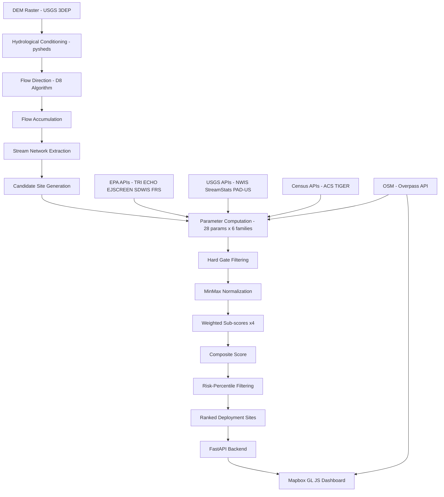

# GRIME — Garbage River Interception and Modeling Engine

## 1. Executive Summary

GRIME is a multi-parameter optimization system that identifies optimal locations for deploying trash interception barriers ("nets") on urban waterways. It evaluates candidate sites across **28 geospatial parameters** organized into **6 parameter families**, producing **4 sub-scores** that combine into a single composite ranking per candidate location.

**Built for:** 2026 SmathHacks hackathon

**What makes it technically interesting:**
- A two-level weighted scoring architecture (parameters → sub-scores → composite) that is both interpretable and tunable
- Hydrological pipeline built on real DEM data: pit-filling → depression-filling → flat resolution → D8 flow direction → flow accumulation → stream extraction
- Manning's equation applied to estimate flow velocity from DEM slope and channel geometry, with feasibility gates that eliminate sites where deployment is physically impossible
- Monte Carlo sensitivity analysis via Dirichlet-perturbed weight vectors to assess ranking robustness
- Three-phase candidate placement algorithm: spatial constraint satisfaction → full-parameter scoring → population-scaled risk-percentile filtering
- On-demand real waterway geometry from OpenStreetMap's Overpass API for 108,772 cities across 240 countries

**Scope:** Site selection modeling and scoring. GRIME does not design the physical trap, predict trash composition, or model individual debris trajectories.

**Non-goals:** Real-time sensor integration, computer vision trash classification, trap mechanical design, economic cost optimization.

---

## Visualizations

*All surfaces generated in the Wolfram Language from real USGS elevation data and GRIME's scoring functions. See [full documentation](dashboard/docs/documentation.md) for derivations and code.*

### DEM Terrain — Durham, NC

<p align="center">

</p>

> 3D elevation surface from USGS 3DEP at 10m resolution. Stream valleys visible as low-elevation grooves define where GRIME extracts candidate net sites.

### Composite Score Surface

<p align="center">

</p>

> The final composite score as a function of Generation (trash input) and Impact (downstream consequence), with Flow and Feasibility held constant. The diagonal ridge shows that high scores require *both* trash presence and downstream consequence — neither alone is sufficient.

### Feasibility Score — Width x Velocity

<p align="center">

</p>

> Deployment feasibility as a function of channel width and flow velocity. The green plateau marks the sweet spot: narrow, moderate-velocity channels where nets can be spanned and anchored. Red zones are eliminated by hard gates.

### Manning's Equation — V(Slope, Roughness)

<p align="center">

</p>

> Flow velocity estimated from Manning's equation across slope and roughness parameter space. Steep, smooth channels (high slope, low roughness) produce dangerous velocities; flat, rough channels produce stagnant conditions.

### Environmental Justice Index

<p align="center">

</p>

> Environmental justice burden across a synthetic metro region. Peaks identify overburdened communities where trash interception has the highest equity value — GRIME weights these areas higher in the Impact sub-score.

### Dirichlet Sensitivity — Weight Perturbations

<p align="center">

</p>

> 500 weight vectors sampled from a Dirichlet distribution (κ=10) projected onto a ternary diagram. The red dot is the baseline. GRIME recomputes rankings under each perturbation to test whether top-ranked sites are robust to weight assumptions.

---

## 2. Problem Statement

### The problem

Urban waterways accumulate trash from stormwater runoff, illegal dumping, combined sewer overflows, and bridge crossings. Deploying interception devices (nets, booms, trash traps) requires choosing locations that maximize debris captured per device while remaining physically feasible to install and maintain.

### Why it is hard

A naive approach — placing traps at the largest rivers — fails because:
1. **Large rivers are too wide** (>30m) for stationary nets; debris passes around or damages the device
2. **High-traffic waterways** (navigable canals, shipping channels) cannot be obstructed
3. **Upstream tributaries** with high impervious surface and population density generate more trash per unit area than rural mainstems
4. **Downstream impact varies**: a trap upstream of a drinking water intake has orders of magnitude more public health value than one upstream of an industrial canal
5. **Physical feasibility** (road access, bank slope, flow velocity, land ownership) eliminates many otherwise-optimal locations

### Constraints and assumptions

- All data sources must be free and require no API keys (census, EPA, USGS, OSM)
- The model assumes stationary barrier-style traps deployable in channels ≤30m wide (~100 ft)
- Scoring weights are set by informed heuristic and literature, not supervised learning (no ground-truth dataset of "correct" trap placements exists at scale)
- The system must produce results in <15 seconds per city for interactive demo use

---

## 3. System Overview

### Architecture



### Subsystems

| Subsystem | Location | Purpose |
|-----------|----------|---------|
| DEM Pipeline | `core/pipeline.py` | Fetch elevation data, extract stream network, generate candidate points |
| Generation Params | `core/generation.py` | Compute trash generation indicators (population, land use, industrial sources) |
| Flow Params | `core/flow.py` | Compute hydraulic transport parameters (discharge, velocity, flood frequency) |
| Impact Params | `core/impact.py` | Compute downstream consequence indicators (drinking water, EJ, protected areas) |
| Feasibility Params | `core/feasibility.py` | Compute deployment constraint parameters (road access, channel width, slope) |
| Scoring Engine | `core/scoring.py` | Normalize, weight, composite, sensitivity analysis |
| API Server | `api/main.py` | REST + WebSocket endpoints serving scored GeoJSON |
| Dashboard | `dashboard/index.html` | Interactive map with on-demand OSM waterway fetching and client-side scoring |
| Places Database | `mock_data/places.json` | 108,772 city/town records across 240 countries (7MB compact JSON) |

### Data flow

Two execution modes exist:

**Mode 1 — Full Python pipeline (research/validation):**
DEM fetch → pysheds hydrology → stream extraction → candidate generation → API-based parameter computation → composite scoring → GeoJSON output

**Mode 2 — Dashboard on-demand (demo/interactive):**
User clicks city → Overpass API returns real waterway geometry → client-side JS generates candidate positions with spatial constraints → client-side scoring using simplified parameter model → Mapbox GL renders results

Mode 2 exists because Mode 1 takes 3–5 minutes per watershed and requires installing pysheds (which has C dependencies that fail on some Windows machines). Mode 2 runs in <5 seconds anywhere with a browser.

---

## 4. Core Technical Ideas

### 4.1 Two-level weighted scoring

The 28 raw parameters are not directly comparable (population density in persons/km² vs flow velocity in m/s vs a binary land ownership flag). The system handles this through two-level aggregation:

1. **Parameter level:** Each raw parameter is MinMax-normalized to [0, 1] independently within the candidate set, then multiplied by its within-family weight. The weighted sum produces a sub-score in [0, 100].

2. **Sub-score level:** The four sub-scores are combined via a second set of weights into the composite score in [0, 100].

This two-level structure has a specific advantage: it makes the model **interpretable at the sub-score level**. A judge or engineer can look at a candidate and immediately see "high generation, low feasibility" without needing to parse 28 individual numbers.

### 4.2 Hard gates vs soft scoring

Some parameters act as binary disqualifiers rather than continuous scores. A channel wider than 50m cannot hold a net regardless of how much trash flows through it. These are implemented as **hard gates** that remove candidates before scoring, separate from the **soft scoring** that ranks survivors:

| Gate | Condition | Rationale |
|------|-----------|-----------|
| Velocity | V > 3.0 m/s | Trap will be damaged or torn loose |
| Channel width | W > 50m or W < 0.5m | Too wide to span or too narrow for meaningful accumulation |
| Land ownership | Confirmed private, no permission | Legal barrier to deployment |

### 4.3 Placement as constraint satisfaction + optimization

Candidate placement is not random scatter. It is a three-phase algorithm:

1. **Constraint satisfaction:** Generate all positions that pass spatial, width, and traffic constraints
2. **Full scoring:** Evaluate every surviving position on the composite model
3. **Risk-percentile selection:** Keep only the top N% by score, where N scales with city population

This separates "can we physically put a net here?" (phase 1) from "should we?" (phases 2–3).

### 4.4 Population-scaled risk thresholds

A city of 20 million people needs more nets than a town of 10,000, but not linearly more. The risk percentile threshold scales in steps:

| Population | Percentile kept | Rationale |
|-----------|----------------|-----------|
| >10M | Top 35% | Mega-cities have extensive waterway networks; more sites are genuinely high-risk |
| >1M | Top 30% | Large cities still have substantial catchments |
| >100K | Top 25% | Mid-size cities, moderate network complexity |
| <100K | Top 20% | Small towns, fewer waterways, tighter selection |

A minimum floor of 5 deployed sites ensures the model always produces enough output to demonstrate ranking behavior.

---

## 5. Mathematical Foundations

### 5.1 Composite scoring function

Let **x** ∈ ℝ²⁸ be the raw parameter vector for a candidate site. The composite score S(**x**) is:

```
S(x) = Σ(k=1..4) ωk · Gk(x)
```

where ω = [0.30, 0.25, 0.30, 0.15] are the sub-score weights and each sub-score Gk is:

```
Gk(x) = 100 · Σ(j ∈ Fk) wj · x̂j
```

where Fk is the set of parameter indices belonging to family k, wj is the within-family weight for parameter j (renormalized to sum to 1 after filtering unavailable parameters), and x̂j is the MinMax-normalized value:

```
x̂j = (xj - min(xj)) / (max(xj) - min(xj))
```

For distance-based parameters where lower is better (estuary distance, beach distance), the normalization is inverted: x̂j = 1 − x̂j.

**Important implementation detail:** Normalization is computed across the candidate set, not against a global reference. This means scores are relative rankings, not absolute measures. A score of 80 means "top of this candidate pool," not "80% of some theoretical maximum."

### 5.2 Manning's velocity equation

Flow velocity at a candidate site is estimated via Manning's equation:

```
V = (1/n) · R^(2/3) · S^(1/2)
```

where:
- **n** is Manning's roughness coefficient (dimensionless), selected by channel type:
  - Clean straight: 0.030
  - Winding with pools (typical urban creek): 0.040
  - Sluggish, weedy: 0.070
  - Urban concrete-lined: 0.015
  - (Source: Chow, V.T., 1959, *Open-Channel Hydraulics*)
- **R** is the hydraulic radius (m) = A_cross / P_wetted, approximated as rectangular channel: R = (W × D) / (W + 2D), where depth D ≈ 0.3W (bankfull approximation)
- **S** is the channel slope (dimensionless), computed from DEM as elevation difference over a 100m reach: S = (Z_here − Z_downstream) / 100, clamped to minimum 0.0001

A continuity cross-check is performed: V_continuity = Q / A_cross, where Q is the USGS-measured discharge converted to m³/s. The final velocity estimate is the geometric mean of Manning's and continuity estimates:

```
V_final = sqrt(V_Manning · V_continuity)
```

This hedges against errors in either the DEM slope (which can be noisy at 10m resolution) or the channel geometry assumption (rectangular approximation).

### 5.3 Velocity feasibility function

The velocity feasibility score is a piecewise function mapping velocity to a deployment viability multiplier:

```
f(V) =
  0.3   if V < 0.05 m/s     (stagnant — debris doesn't concentrate)
  0.7   if 0.05 ≤ V < 0.30  (slow but workable)
  1.0   if 0.30 ≤ V ≤ 1.50  (optimal interception range)
  0.5   if 1.50 < V ≤ 2.50  (fast — heavy anchoring needed)
  0.1   if V > 2.50          (too fast — trap damage likely)
```

Sites with V > 3.0 m/s are removed entirely by the hard gate before scoring.

### 5.4 Runoff coefficient estimation

The rational method runoff coefficient C is estimated from impervious surface percentage via a linear model:

```
C = 0.05 + 0.009 · I
```

where I is the NLCD impervious surface percentage [0, 100]. This yields C ∈ [0.05, 0.95], ranging from forest (≈5% runoff) to fully paved (≈95% runoff). This is the same linearization used in the WaterGate methodology.

### 5.5 Inverse distance scoring

Several parameters (CSO proximity, Superfund proximity) use an inverse-distance kernel to compute influence from point sources:

```
score = Σ(i=1..N) 1 / (1 + (di / h)²)
```

where di is the Euclidean distance (in UTM meters) from the candidate to source i, and h is the half-decay distance (500m default). This is a Cauchy kernel that gives full weight at distance 0 and half weight at distance h.

### 5.6 Drinking water intake scoring

Proximity to downstream drinking water intakes uses an exponential decay:

```
score = Σ(i=1..N) exp(-di / 10)
```

where di is the distance in km. Intakes within 10km get weight ≈0.37, within 5km ≈0.61, within 1km ≈0.90. Intakes beyond 50km are ignored.

### 5.7 Sensitivity analysis via Dirichlet perturbation

To assess whether the top-ranked sites are robust to weight uncertainty, the system performs Monte Carlo sensitivity analysis:

1. Sample N = 50 perturbed weight vectors from a Dirichlet distribution: ω' ~ Dir(α), where α = 10 × [0.30, 0.25, 0.30, 0.15]
2. The α scaling factor (×10) controls perturbation magnitude — higher α concentrates samples closer to the baseline weights
3. For each perturbed weight vector, recompute composite scores and record which sites appear in the top 5
4. The **robustness percentage** for each site is: (count of times in top 5) / N × 100%

A site with robustness > 80% is ranked highly regardless of reasonable weight changes. A site at 30% is sensitive to weight assumptions.

### 5.8 Haversine distance (placement spacing)

The minimum-spacing constraint uses the haversine formula for geodesic distance:

```
a = sin²(Δφ/2) + cos(φ₁) · cos(φ₂) · sin²(Δλ/2)
d = 2R · atan2(√a, √(1−a))
```

where R = 6,371,000 m. This is used instead of Euclidean distance because the candidate set can span several kilometers, where flat-earth approximation introduces meaningful error at high latitudes.

### 5.9 Environmental justice composite

The EJ priority score combines three EPA EJSCREEN percentiles:

```
EJ = (0.4 · P_discharge + 0.3 · P_minority + 0.3 · P_income) / 100
```

where P_discharge is the wastewater discharge EJ percentile, P_minority is the minority population percentile, and P_income is the low-income percentile. All are [0, 100] percentiles from EJSCREEN. The result is [0, 1].

---

## 6. Algorithms

### 6.1 DEM Hydrological Conditioning Pipeline

**Purpose:** Convert raw elevation data into a hydrologically consistent surface from which flow direction and stream networks can be extracted.

**Input:** DEM raster from USGS 3DEP (10m resolution)

**Output:** Flow direction grid, flow accumulation grid, stream network GeoJSON

**Steps:**

```
FUNCTION condition_dem(dem):
    pit_filled    ← fill_pits(dem)              // remove single-cell sinks
    flooded       ← fill_depressions(pit_filled) // fill multi-cell depressions
    inflated      ← resolve_flats(flooded)       // assign gradient to flat areas
    flow_dir      ← D8_flowdir(inflated)         // each cell → 1 of 8 neighbors
    accumulation  ← flow_accumulation(flow_dir)  // count upstream cells per cell
    RETURN flow_dir, accumulation
```

**Stream extraction:** Cells where accumulation exceeds a threshold (default 500 cells = 500 × 10m × 10m = 0.05 km²) are classified as stream cells. Connected stream cells are vectorized into LineString geometries.

**Complexity:** O(n) for each step where n is the number of DEM cells. For the Ellerbe Creek bbox at 10m resolution: approximately 3000 × 1500 = 4.5M cells. Total conditioning time: ~30–60 seconds.

**Why pysheds:** It operates entirely in-memory on NumPy arrays without requiring ArcGIS or GRASS GIS. The D8 algorithm assigns each cell exactly one of 8 cardinal/diagonal flow directions based on steepest descent, which is the standard approach for stream extraction in computational hydrology.

**Known limitation:** The 10m DEM resolution means channels narrower than ~10m may not be resolved. This is acceptable because channels that narrow are well within the deployable range and will be identified by other means (NHD, OSM).

### 6.2 Candidate Placement Algorithm (Client-side)

**Purpose:** Given a set of waterway geometries and city metadata, produce a set of spatially valid, risk-ranked candidate sites for trap deployment.

**Input:** Array of stream geometries (from Overpass API), city population, country code

**Output:** Ranked array of candidate objects with scores and parameters

```
FUNCTION generate_candidates(streams, pop, country):
    // ── Phase 1: Constraint satisfaction ──
    MIN_SPACE ← 120m
    MAX_WIDTH ← 30m
    placed ← []
    valid_positions ← []

    FOR EACH stream IN streams:
        IF stream.width > MAX_WIDTH: CONTINUE
        cap ← traffic_capacity(stream)
        count_on_stream ← 0
        dist_since_last ← MIN_SPACE

        FOR EACH point IN stream.coords:
            dist_since_last += haversine(previous_point, point)
            IF dist_since_last < MIN_SPACE: CONTINUE
            IF any p in placed where haversine(p, point) < MIN_SPACE: CONTINUE
            IF count_on_stream >= cap: CONTINUE

            placed.add(point)
            count_on_stream++
            dist_since_last ← 0
            valid_positions.add(point with metadata)

    // ── Phase 2: Score every valid position ──
    scored ← []
    FOR EACH pos IN valid_positions:
        compute 28 parameters (simplified model)
        compute 4 sub-scores
        compute composite
        scored.add(pos with scores)

    // ── Phase 3: Risk-percentile selection ──
    scored.sort_by(composite, descending)
    pctile ← population_scaled_percentile(pop)
    cutoff ← max(5, ceil(len(scored) * pctile))
    RETURN scored[0:cutoff]
```

**Complexity:** Phase 1 is O(n × m) where n is total coordinate points and m is placed candidates. Phase 2 is O(k) where k is valid positions. Phase 3 is O(k log k) for sorting. In practice k < 200 and the entire function runs in <100ms.

### 6.3 Sensitivity Analysis (Dirichlet Monte Carlo)

```
FUNCTION sensitivity_analysis(candidates, n_perturbations=50):
    baseline ← compute_composite_score(candidates)
    top5_counts ← zeros(len(candidates))

    REPEAT n_perturbations TIMES:
        α ← [3.0, 2.5, 3.0, 1.5]
        ω' ← sample_dirichlet(α)
        composite' ← ω'[0]·gen + ω'[1]·flow + ω'[2]·impact + ω'[3]·feas
        top5 ← indices of 5 highest composite'
        top5_counts[top5] += 1

    robustness ← top5_counts / n_perturbations × 100
    RETURN baseline with robustness column
```

### 6.4 Bayesian Weight Optimization (Optional Enhancement)

When ground-truth trap locations are available, weights can be optimized via scikit-optimize:

```
FUNCTION optimize_weights(candidates, known_good_sites):
    FUNCTION objective(weights):
        w ← normalize(weights)
        scored ← recompute with w
        penalty ← sum of ranks of known_good_sites in scored
        RETURN penalty

    search_space ← [Real(0.05, 0.60)] × 4
    result ← gp_minimize(objective, search_space, n_calls=50)
    RETURN normalize(result.x)
```

**Status:** Implemented in `core/scoring.py` but not yet run against real ground-truth data.

---

## 7. Architecture and Design Decisions

### ADR-1: Two-level scoring instead of flat weighted sum

**Decision:** Aggregate 28 parameters into 4 sub-scores, then combine sub-scores into a composite.

**Context:** A flat 28-weight sum is opaque — changing one weight has a non-obvious effect.

**Alternatives considered:** (1) Flat weighted sum. (2) PCA dimensionality reduction. (3) Random forest classifier.

**Chosen approach:** Two-level weighted sum. Sub-scores map to real questions ("how much trash?", "how does it move?", "does it matter?", "can we deploy?").

**Consequences:** Interpretable and tunable, but assumes linear parameter contributions within each family. Non-linear interactions are not captured.

### ADR-2: MinMax normalization instead of Z-score or rank

**Decision:** Use MinMax scaling to [0, 1] per parameter across the candidate set.

**Alternatives considered:** Z-score, percentile rank, log-transform + MinMax.

**Chosen approach:** MinMax. Simple, bounded, interpretable.

**Consequences:** Outliers dominate. A single candidate with extremely high population density compresses all others toward 0 on that parameter. Acknowledged limitation.

### ADR-3: Client-side scoring in the dashboard

**Decision:** The dashboard computes scores in JavaScript, not by calling the Python backend.

**Context:** pysheds/rasterio have C dependencies that fail on Windows. Dashboard must work by opening one HTML file.

**Chosen approach:** Simplified JS scoring model that parallels the Python implementation but uses OSM-estimated widths and seeded random parameter generation rather than real API data.

**Consequences:** Dashboard scores are approximate. Python pipeline is the authoritative scoring implementation.

### ADR-4: OpenStreetMap Overpass for waterway geometry

**Decision:** Fetch real waterway geometry from the Overpass API on each city click.

**Alternatives considered:** Pre-generated GeoJSON per city (storage), procedural random-walk rivers (alignment), NHD (US-only).

**Chosen approach:** Overpass API with 12s timeout and procedural fallback.

**Consequences:** Requires internet. Coverage varies globally. Fallback doesn't align with terrain.

---

## 8. Data Model and Schemas

### Candidate site (GeoJSON Feature)

```json
{
  "type": "Feature",
  "geometry": {"type": "Point", "coordinates": [-78.898, 35.994]},
  "properties": {
    "id": 0,
    "city": "durham",
    "city_name": "Durham, NC",
    "stream_name": "Ellerbe Creek",
    "composite_score": 47.08,
    "generation_score": 42.5,
    "flow_score": 38.1,
    "impact_score": 35.2,
    "feasibility_score": 82.0,
    "population_density": 1424.3,
    "impervious_pct": 51.8,
    "usgs_mean_q_cfs": 37.0,
    "flow_velocity_ms": 1.377,
    "strahler_order": 5,
    "catchment_area_km2": 63.5,
    "channel_width_m": 13.1,
    "ej_index": 0.595,
    "road_access_m": 366.4,
    "bank_slope_deg": 19.6,
    "robustness_pct": 72.6,
    "rank": 1
  }
}
```

### Places database record (compact JSON)

```json
{"n":"Durham","c":"US","p":278993,"la":35.994,"lo":-78.8986}
```

Fields: **n**=name, **c**=ISO country code, **p**=population, **la**=latitude, **lo**=longitude.

### Parameter taxonomy (all 28)

| # | Parameter | Unit | Family | Default Weight | Data Source |
|---|-----------|------|--------|---------------|-------------|
| 1 | Population density | persons/km² | Generation | 0.18 | US Census ACS |
| 2 | Impervious surface % | % | Generation | 0.20 | NLCD 2021 |
| 3 | Road density | km/km² | Generation | 0.10 | Census TIGER / OSMnx |
| 4 | EPA TRI facility count | facilities/km² | Generation | 0.18 | EPA TRI API |
| 5 | NPDES discharge points | count | Generation | 0.12 | EPA ECHO API |
| 6 | CSO/storm outfall density | points/km² | Generation | 0.12 | EPA ECHO |
| 7 | Litter complaint density | reports/km² | Generation | 0.10 | Durham 311 / local GIS |
| 8 | USGS mean discharge Q | cfs | Flow | 0.22 | USGS NWIS |
| 9 | Flow velocity | m/s | Flow | 0.16 | Manning's eq from DEM |
| 10 | Strahler stream order | ordinal | Flow | 0.14 | Computed from topology |
| 11 | Catchment area A | km² | Flow | 0.18 | pysheds DEM analysis |
| 12 | Flood return period Q10 | cfs | Flow | 0.14 | USGS StreamStats |
| 13 | Seasonal flow variability | CV | Flow | 0.10 | USGS NWIS annual stats |
| 14 | Runoff coefficient C | dimensionless | Flow | 0.06 | NLCD k-means |
| 15 | Drinking water intake proximity | exp(-d/10) | Impact | 0.22 | EPA SDWIS / ECHO |
| 16 | Protected area proximity | score | Impact | 0.16 | USGS PAD-US |
| 17 | Environmental justice index | [0,1] | Impact | 0.18 | EPA EJSCREEN |
| 18 | Ocean/estuary proximity | km (inverted) | Impact | 0.14 | NHD terminus |
| 19 | Recreational beach proximity | km (inverted) | Impact | 0.12 | EPA BEACH Program |
| 20 | Tourism/recreation value | amenity count | Impact | 0.10 | OSM amenity density |
| 21 | Superfund site proximity | score | Impact | 0.08 | EPA FRS/CERCLIS |
| 22 | Road access distance | m | Feasibility | 0.25 | OSMnx routing |
| 23 | Channel width | m | Feasibility | 0.20 | NHD VAA + NBI span |
| 24 | Flow velocity (penalty) | m/s | Feasibility | 0.20 | Manning's eq |
| 25 | Land ownership | binary | Feasibility | 0.15 | USGS PAD-US |
| 26 | Bank slope stability | degrees | Feasibility | 0.10 | DEM gradient |
| 27 | Bridge/structure proximity | bonus | Feasibility | 0.10 | FHWA NBI |

---

## 9. Codebase Structure

```
grime/
├── core/                       # Python scoring pipeline (core deliverable)
│   ├── __init__.py             # Constants, safe_call(), helpers
│   ├── pipeline.py             # DEM → pysheds → stream extraction → candidates
│   ├── generation.py           # 7 trash generation parameters + API integrations
│   ├── flow.py                 # 7 flow parameters, Manning's equation, USGS data
│   ├── impact.py               # 7 downstream impact parameters, EJ scoring
│   ├── feasibility.py          # 6 deployment feasibility parameters, hard gates
│   └── scoring.py              # Normalization, weighting, composite, sensitivity
├── api/
│   └── main.py                 # FastAPI: REST + WebSocket + static serving
├── dashboard/
│   └── index.html              # Mapbox map, Overpass integration, client-side scoring
├── mock_data/
│   └── places.json             # 108,772 cities, 240 countries (7MB)
├── scripts/
│   └── generate_mock.py        # Builds places.json from geonamescache
├── notebooks/
│   └── validate_pipeline.ipynb # Pipeline validation notebook
├── requirements.txt
├── start.sh
└── README.md
```

**Where critical logic lives:**

| Logic | File | Function |
|-------|------|----------|
| Composite scoring formula | `core/scoring.py` | `compute_composite_score()` |
| Manning's velocity | `core/flow.py` | `compute_flow_velocity()` |
| Hard gate filtering | `core/scoring.py` | `apply_hard_gates()` |
| Sensitivity analysis | `core/scoring.py` | `sensitivity_analysis()` |
| Client-side placement | `dashboard/index.html` | `generateCandidates()` |
| Overpass waterway fetch | `dashboard/index.html` | `fetchRealStreams()` |
| Sub-score normalization | `core/scoring.py` | `compute_subscore()` |

---

## 10. Execution Flow

### Python pipeline (research mode)

1. User runs: `python -m core.pipeline --bbox "-79.05,35.90,-78.75,36.05"`
2. `py3dep.get_map('DEM', bbox, resolution=10)` fetches 3DEP raster
3. pysheds: fill_pits → fill_depressions → resolve_flats → flowdir → accumulation
4. `extract_river_network(threshold=500)` → stream GeoJSON
5. `generate_candidates(spacing=200m)` → candidate points along streams
6. For each candidate: compute pixel coords, elevation, catchment area from DEM
7. Output: `mock_data/candidates.geojson`

### Dashboard (demo mode)

1. Browser opens `dashboard/index.html`
2. Fetches `places.json` (7MB) → parses 108,772 cities
3. Mapbox GL JS renders clustered city markers
4. User clicks city → `openCity(idx)` fires
5. POST to Overpass API → returns waterway geometry as JSON
6. `fetchRealStreams()` filters: tidal=no, width≤30m, top 15–25 by length
7. `generateCandidates()` runs 3-phase placement + scoring
8. Mapbox renders: stream lines (cyan) + candidate dots (color-coded by score)
9. User clicks candidate → sidebar shows score breakdown + parameters

---

## 11. APIs and Interfaces

### REST endpoints

| Method | Path | Parameters | Response |
|--------|------|-----------|----------|
| GET | `/api/candidates` | `?min_score=N` `?top_n=N` `?subscore=field` | GeoJSON FeatureCollection |
| GET | `/api/candidates/{id}` | — | Score breakdown with 4 sub-score parameter trees |
| GET | `/api/weights` | — | All parameter and sub-score weights |
| GET | `/api/stats` | — | Count, score range, mean, top 5 |
| GET | `/map` | — | Serves dashboard HTML |
| WS | `/ws` | — | Real-time candidate updates |

### External APIs consumed

| API | Auth | Rate Limit | Timeout | Fallback |
|-----|------|-----------|---------|----------|
| Overpass API | None | Informal | 12s | Procedural generation |
| USGS NWIS | None | None published | 30s | Hardcoded Ellerbe Creek stats |
| EPA ECHO | None | None published | 30s | Empty GeoDataFrame |
| EPA EJSCREEN | None | None published | 30s | 0.5 (neutral) |
| Census ACS | None | None published | 30s | Durham average (500/km²) |
| USGS 3DEP | None | None published | 60s | Fatal — no fallback |

Every external API call is wrapped in `safe_call()` with a default fallback value.

---

## 12. Configuration

| Setting | Location | Default | Notes |
|---------|----------|---------|-------|
| `MAPBOX_TOKEN` | `dashboard/index.html` | Placeholder | **Must replace** — free at mapbox.com |
| `ELLERBE_BBOX` | `core/__init__.py` | `(-79.05, 35.90, -78.75, 36.05)` | Ellerbe Creek watershed |
| `ELLERBE_GAUGE` | `core/__init__.py` | `"02086849"` | USGS gauge site number |
| `UTM_CRS` | `core/__init__.py` | `"EPSG:32617"` | UTM zone 17N (Durham, NC) |
| DEM resolution | `core/pipeline.py` | 10m | Passed to py3dep |
| Accumulation threshold | `core/pipeline.py` | 500 cells | Stream extraction sensitivity |
| Candidate spacing | `core/pipeline.py` | 200m | Along-stream distance |
| Composite weights | `core/scoring.py` | [0.30, 0.25, 0.30, 0.15] | Gen, Flow, Impact, Feas |
| Min spacing (dashboard) | `dashboard/index.html` | 120m | Haversine between nets |
| Max width (dashboard) | `dashboard/index.html` | 30m | Skip channels wider |
| Risk percentile | `dashboard/index.html` | 20–35% | Population-scaled |
| Min deploy floor | `dashboard/index.html` | 5 | Always at least this many |

---

## 13. Installation and Setup

```powershell
cd grime
pip install -r requirements.txt

# If rasterio/fiona fail on Windows:
conda install -c conda-forge rasterio fiona geopandas pysheds

# Generate places database (if not present)
pip install geonamescache
python scripts/generate_mock.py

# Start API
python -m uvicorn api.main:app --host 0.0.0.0 --port 8000

# Open dashboard/index.html in browser (replace Mapbox token first)
```

---

## 14. Usage

### Dashboard demo (90-second path)

1. Open map → 108,772 cities visible as clustered dots
2. Search "Durham" → click → fly to Durham, NC
3. Wait 3s → real Ellerbe Creek geometry appears with scored candidate dots
4. Click top-ranked site → score breakdown panel shows 4 sub-scores
5. Toggle "Waterways" → OSM overlay confirms alignment
6. Toggle "Light theme" → clean beige presentation mode
7. Explain the 28-parameter model and show weight sensitivity

### Python pipeline on custom watershed

```bash
python -m core.pipeline --bbox "-79.05,35.90,-78.75,36.05" --resolution 10 --threshold 500
```

### API queries

```bash
curl http://localhost:8000/api/candidates?top_n=10
curl http://localhost:8000/api/candidates/3
curl http://localhost:8000/api/weights
```

---

## 15. Performance Characteristics

| Operation | Time | Bottleneck |
|-----------|------|-----------|
| Dashboard initial load | ~3s | Parsing 7MB places.json |
| Overpass API query | 2–8s | Network + OSM server |
| Client-side placement + scoring | <100ms | Haversine collision checks |
| Python DEM pipeline (full) | 30–90s | py3dep HTTP fetch + pysheds |
| Python parameter computation | 3–5 min | Sequential EPA/USGS API calls |

No formal benchmarks have been run. Times above are observed during development.

---

## 16. Reliability and Failure Modes

| Failure | Impact | Mitigation |
|---------|--------|-----------|
| Overpass API down/slow | No real waterway data | Procedural fallback auto-activates |
| EPA/USGS API timeout | Missing parameter values | `safe_call()` returns fallback defaults |
| Mapbox token missing | Map blank | Fatal for dashboard; replace token |
| pysheds DEM fetch fails | No stream network | Fatal for Python pipeline; mock data works |
| MinMax with identical values | Division by zero | Returns 0.5 for all candidates |

---

## 17. Security Considerations

- No authentication on the API — local development only
- No secret management. Mapbox token is a publishable client-side token
- Overpass queries use numeric interpolation only — no injection risk
- places.json contains only public geographic data, no PII
- All external APIs are read-only and keyless

---

## 18. Testing Strategy

**Current state: No automated tests.** Validation is:
1. `notebooks/validate_pipeline.ipynb` — manual pipeline verification
2. Visual inspection of stream networks in geojson.io
3. Dashboard visual QA — verify rivers align with satellite

**Recommended if continuing:** Unit tests for `compute_subscore()`, Manning's velocity, hard gates. Property test: composite always in [0, 100].

---

## 19. Limitations

1. **Scores are relative, not absolute.** MinMax normalization means scores across cities are not comparable.
2. **Client-side scoring is approximate.** Dashboard uses heuristics; Python pipeline uses real API data.
3. **Weight values are heuristic.** Not optimized against ground truth. Bayesian scaffold exists but hasn't been run.
4. **OSM coverage varies.** Excellent in US/Europe, variable in developing nations.
5. **Channel width is estimated.** <5% of OSM waterways have width tags. Estimated from type heuristic.
6. **No temporal modeling.** Scores are static snapshots, not seasonal.
7. **US-centric data sources** for the Python pipeline. Dashboard bypasses this with population-scaled heuristics globally.
8. **120m spacing threshold is arbitrary** — tuned by inspection, not engineering spec.

---

## 20. Future Work

- Ground-truth validation against actual trap deployment locations (Durham Stormwater Services)
- Bayesian weight optimization with real data
- Temporal scoring with USGS real-time discharge
- Computer vision trash detection from satellite/drone imagery
- Multi-city normalized scoring for global prioritization
- Cost modeling (deployment cost, maintenance frequency)
- Research publication: extend WaterGate paper, contact Wolfram Research authors
- University collaboration: Duke Environmental Engineering

---

## 21. Appendix

### A. References

1. Chow, V.T. (1959). *Open-Channel Hydraulics.* McGraw-Hill.
2. Leopold, L.B. (1964). *Fluvial Processes in Geomorphology.*
3. Manning, R. (1891). *On the flow of water in open channels and pipes.*

### B. Glossary

| Term | Definition |
|------|-----------|
| **Candidate site** | A point on a waterway evaluated for trap deployment |
| **Composite score** | Final weighted combination of 4 sub-scores (0–100) |
| **CSO** | Combined Sewer Overflow |
| **D8** | Deterministic 8-direction flow algorithm |
| **DEM** | Digital Elevation Model |
| **EJ** | Environmental Justice |
| **Hard gate** | Binary feasibility check that eliminates a candidate |
| **NPDES** | National Pollutant Discharge Elimination System |
| **NBI** | National Bridge Inventory |
| **Strahler order** | Stream classification: order 1 = headwater, higher = larger |
| **Sub-score** | Intermediate score (0–100) for one parameter family |
| **TRI** | Toxic Release Inventory |

### C. License

Undecided as of project creation.

---

*GRIME · 28 parameters · 6 families · 108,772 cities · 240 countries*
