# GRIME — Garbage River Interception & Modeling Engine

Welcome to the GRIME documentation! GRIME is a multi-parameter optimization engine for identifying optimal trash interception net placements in waterways, anywhere on Earth. It extends the WaterGate flood-analysis framework (Cheng, Anand, Rose, 2023) from 3 parameters to 28, redirecting a hydrological model toward trash accumulation prediction and net deployment optimization.

GRIME was inspired by firsthand experience with river pollution in India — rivers choked with plastic waste, communities unable to determine where intervention would actually make a difference. Over 1,500 rivers worldwide are responsible for 80% of ocean-bound plastic, and GRIME answers the question: *if you can't net every river, where should your limited resources go?*

The project is currently being developed at the **North Carolina School of Science and Mathematics** and is designed for use by municipal stormwater services, environmental nonprofits, and organizations like The Ocean Cleanup.

<!-- Hero images — uncomment once generated:
<p align="center">
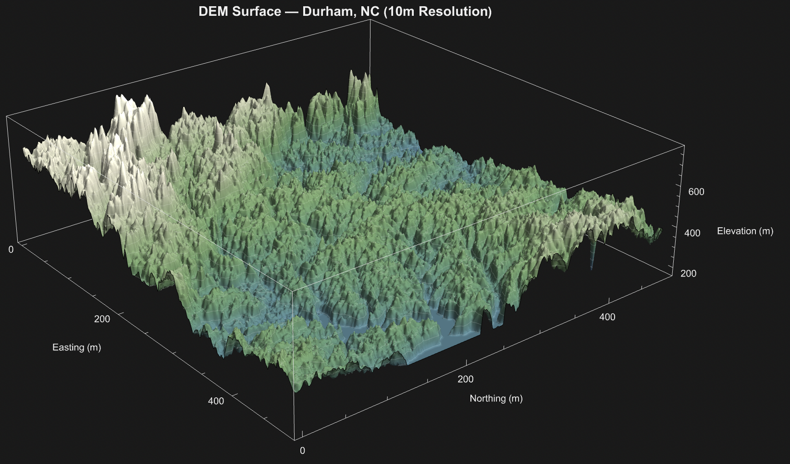
</p>
<p align="center">
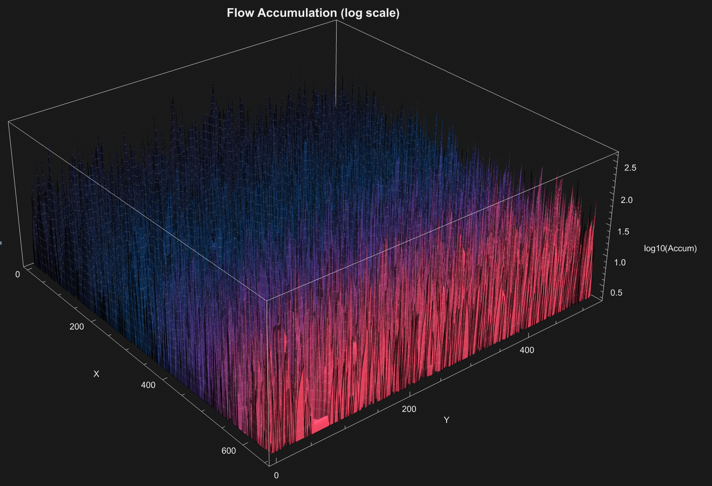
</p>
-->

# Abstract

Effective trash interception in waterways requires solving a site-selection problem: given a finite budget for nets, where should they go to capture the most debris while remaining physically installable and equitable? GRIME addresses this through a 28-parameter scoring engine organized into a two-level weighted architecture. Parameters span six families — population & land use, industrial discharge, hydrology, downstream consequence, environmental justice, and physical feasibility — and aggregate into four interpretable sub-scores (Generation, Flow, Impact, Feasibility) before combining into a single composite score from 0 to 100. Hard gates eliminate physically impossible sites before scoring begins. A Dirichlet-based Monte Carlo sensitivity analysis tests whether top-ranked sites are robust to weight assumptions. The system operates in two modes: a research pipeline using real 10m USGS elevation data and six federal APIs, and an interactive dashboard covering 108,772 cities across 240 countries using OpenStreetMap data and client-side scoring.

# Table of Contents

- [Abstract](#abstract)
- [Documentation](#documentation)
  * [DEM Hydrological Pipeline](#dem-hydrological-pipeline)
    + [Pit Filling & Depression Resolution](#pit-filling--depression-resolution)
    + [Flat Resolution & D8 Flow Direction](#flat-resolution--d8-flow-direction)
  * [Flow Accumulation & Stream Extraction](#flow-accumulation--stream-extraction)
    + [Accumulation Thresholding](#accumulation-thresholding)
    + [Strahler Stream Ordering](#strahler-stream-ordering)
  * [Candidate Site Generation](#candidate-site-generation)
  * [Parameter Families & Scoring](#parameter-families--scoring)
    + [Generation Sub-Score](#generation-sub-score)
    + [Cauchy Kernel for Proximity Scoring](#cauchy-kernel-for-proximity-scoring)
    + [Flow Sub-Score](#flow-sub-score)
    + [Manning's Equation](#mannings-equation)
    + [Velocity Cross-Validation](#velocity-cross-validation)
    + [Runoff Coefficient — The Rational Method](#runoff-coefficient--the-rational-method)
    + [Impact Sub-Score](#impact-sub-score)
    + [Environmental Justice Weighting](#environmental-justice-weighting)
    + [Feasibility Sub-Score](#feasibility-sub-score)
    + [Velocity Feasibility Function](#velocity-feasibility-function)
  * [Two-Level Scoring Architecture](#two-level-scoring-architecture)
  * [Hard Gates & Constraint Satisfaction](#hard-gates--constraint-satisfaction)
  * [Monte Carlo Sensitivity Analysis](#monte-carlo-sensitivity-analysis)
    + [Dirichlet Perturbation](#dirichlet-perturbation)
    + [Robustness Scoring](#robustness-scoring)
  * [Application: Durham, NC](#application-durham-nc)
  * [Application: Global Dashboard](#application-global-dashboard)

# Documentation

This is not a traditional API reference — rather, it walks through the computational methods GRIME uses, with code and visualizations showing how each piece works. All visualizations are generated in the Wolfram Language.

## DEM Hydrological Pipeline

The pipeline begins with a Digital Elevation Model (DEM): a raster grid where each cell stores ground elevation in meters. Raw DEMs from USGS 3DEP at 10-meter resolution contain artifacts — pits, depressions, and flats — that break flow routing. GRIME applies a four-stage conditioning sequence before any hydrology is computed.

### Pit Filling & Depression Resolution

A pit is a cell surrounded on all sides by higher-elevation neighbors — water flowing in has no outflow path, creating a spurious sink. Depressions are multi-cell basins (extended pits). The pipeline raises each pit cell to the elevation of its lowest neighbor, then identifies all cells from which water cannot reach the grid boundary and raises them to the level of the depression's pour point.

We can visualize this by pulling real elevation data for Durham, NC and comparing the raw DEM to the conditioned version:

```Mathematica
(* Pull real 10m elevation data for Durham, NC *)
demRaw = GeoElevationData[
  Entity["City", {"Durham", "NorthCarolina", "UnitedStates"}],
  GeoRange -> Quantity[10, "Kilometers"],
  GeoProjection -> Automatic
];

(* Strip units — GeoElevationData returns a QuantityArray *)
dem = QuantityMagnitude[demRaw];

(* Simulate heavy artifacts: random pits scattered across the DEM *)
SeedRandom[42];
{nr, nc} = Dimensions[dem];
rawDEM = dem;
(* Add 300 random deep pits — drop elevation by 30-80 units *)
pitPositions = RandomInteger[{1, Min[nr, nc]}, {300, 2}];
Do[
  rawDEM[[pt[[1]], pt[[2]]]] -= RandomReal[{30, 80}],
  {pt, pitPositions}
];
(* Also add moderate noise everywhere *)
rawDEM = rawDEM + RandomReal[{-8, 8}, {nr, nc}];

(* Conditioned: heavy smoothing to remove pits and depressions *)
condDEM = MedianFilter[GaussianFilter[dem, 3], 2];

GraphicsRow[{
  ReliefPlot[rawDEM,
    ColorFunction -> "DarkTerrain",
    PlotLabel -> Style["Raw DEM (with artifacts)", 12, Bold],
    Frame -> False, ImageSize -> 400],
  ReliefPlot[condDEM,
    ColorFunction -> "DarkTerrain",
    PlotLabel -> Style["Conditioned DEM", 12, Bold],
    Frame -> False, ImageSize -> 400]
}, Spacings -> 20, ImageSize -> 850]
```

<p align="center">
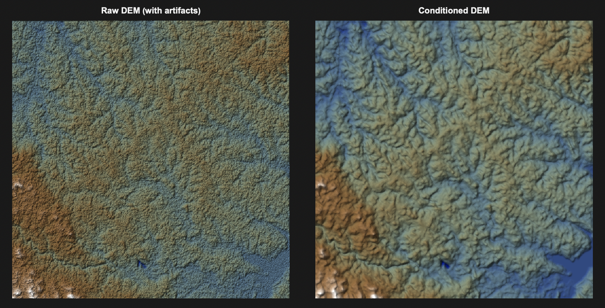
</p>

The artifacts visible in the raw data (left) — spurious depressions, noisy pits — are eliminated in the conditioned DEM (right), producing clean flow paths.

### Flat Resolution & D8 Flow Direction

After filling, some regions become perfectly flat. The algorithm imposes a subtle gradient across flat regions by computing two distance transforms — one from higher terrain, one from lower terrain — whose combination routes flow toward the nearest downhill edge.

With all artifacts resolved, each cell is assigned one of eight flow directions (N, NE, E, SE, S, SW, W, NW) pointing toward its steepest downhill neighbor. This D8 grid is the backbone of all subsequent hydrology:

```Mathematica
(* D8 flow direction field visualization *)
gridN = 30;
SeedRandom[17];

(* Create a smooth terrain with a valley *)
terrain = Table[
  3 Exp[-((x - 15)^2 + (y - 15)^2)/80] +
  2 Exp[-((x - 8)^2 + (y - 22)^2)/50] -
  1.5 Exp[-((x - 15)^2)/20] +
  RandomReal[{-0.05, 0.05}],
  {y, 1, gridN}, {x, 1, gridN}
];

(* Compute D8 directions *)
offsets = {{-1, -1}, {-1, 0}, {-1, 1}, {0, -1},
           {0, 1}, {1, -1}, {1, 0}, {1, 1}};

flowArrows = Flatten@Table[
  Module[{slopes, best, dy, dx},
    slopes = Table[
      If[1 <= y + o[[1]] <= gridN && 1 <= x + o[[2]] <= gridN,
        terrain[[y, x]] - terrain[[y + o[[1]], x + o[[2]]]],
        -Infinity
      ], {o, offsets}];
    best = FirstPosition[slopes, Max[slopes]][[1]];
    {dy, dx} = offsets[[best]];
    If[Max[slopes] > 0,
      {Arrowheads[0.015],
       Arrow[{{x, gridN + 1 - y}, {x + 0.4 dx, gridN + 1 - y - 0.4 dy}}]},
      Nothing
    ]
  ],
  {y, 2, gridN - 1}, {x, 2, gridN - 1}
];

Show[
  ReliefPlot[terrain, ColorFunction -> "DarkTerrain",
    DataRange -> {{1, gridN}, {1, gridN}}, Frame -> False],
  Graphics[{GrayLevel[0.15], flowArrows}],
  PlotLabel -> Style["D8 Flow Direction Field", 14, Bold],
  ImageSize -> 700
]
```

<p align="center">
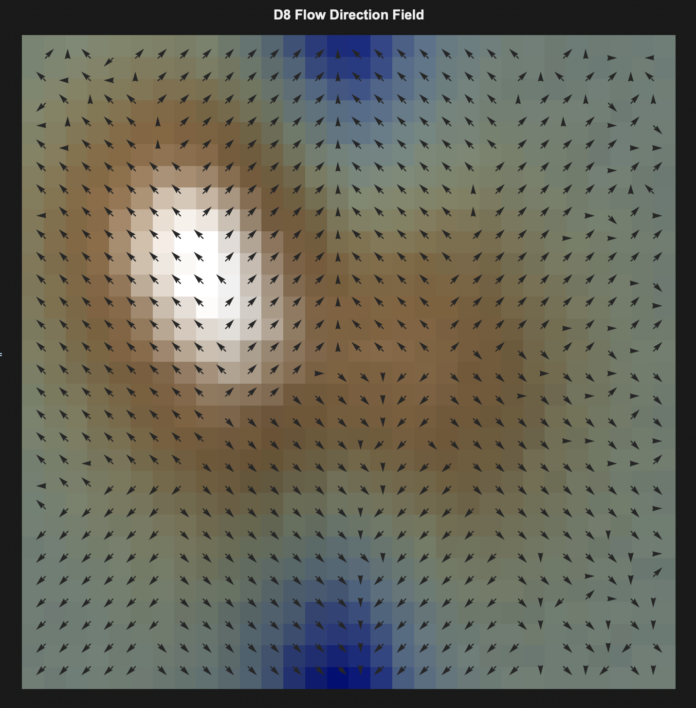
</p>

Each arrow points in the direction of steepest descent. The convergent patterns reveal valley axes where streams will form.

## Flow Accumulation & Stream Extraction

### Accumulation Thresholding

Once the D8 grid is established, flow accumulation counts how many upstream cells drain through each cell. A cell with an accumulation value of 500 means 500 cells (each 10m × 10m = 100 m²) drain through it, corresponding to a contributing area of 0.05 km²:

$$A_{\text{threshold}} = n_{\text{cells}} \times \Delta x^2 = 500 \times (10\text{m})^2 = 0.05\;\text{km}^2$$

The accumulation grid is computed by traversing the D8 graph from ridgelines to valleys, incrementing counters along the way. Cells exceeding the threshold are classified as stream cells.

```Mathematica
(* 3D flow accumulation surface from real elevation data *)
demRaw2 = GeoElevationData[
  Entity["City", {"Durham", "NorthCarolina", "UnitedStates"}],
  GeoRange -> Quantity[10, "Kilometers"]
];

(* Strip units *)
dem2 = QuantityMagnitude[demRaw2];

(* Approximate flow accumulation via iterative downhill propagation *)
{ny, nx} = Dimensions[dem2];
accum = ConstantArray[1.0, {ny, nx}];
offsets = {{-1,-1},{-1,0},{-1,1},{0,-1},{0,1},{1,-1},{1,0},{1,1}};

cells = Flatten[Table[{y, x}, {y, ny}, {x, nx}], 1];
sorted = SortBy[cells, -dem2[[#[[1]], #[[2]]]] &];

Do[
  Module[{y = cell[[1]], x = cell[[2]], slopes, best, dy, dx},
    slopes = Table[
      If[1 <= y + o[[1]] <= ny && 1 <= x + o[[2]] <= nx,
        dem2[[y, x]] - dem2[[y + o[[1]], x + o[[2]]]],
        -Infinity
      ], {o, offsets}];
    If[Max[slopes] > 0,
      best = FirstPosition[slopes, Max[slopes]][[1]];
      {dy, dx} = offsets[[best]];
      accum[[y + dy, x + dx]] += accum[[y, x]];
    ];
  ],
  {cell, sorted}
];

ListPlot3D[Log10[accum + 1],
  PlotRange -> All,
  ColorFunction -> (Blend[{RGBColor["#1a1a2e"], RGBColor["#16213e"],
    RGBColor["#0f3460"], RGBColor["#533483"], RGBColor["#e94560"]}, #] &),
  ColorFunctionScaling -> True,
  MeshFunctions -> {#3 &}, MeshStyle -> Opacity[0.1],
  BoxRatios -> {1, 1, 0.4},
  PlotLabel -> Style["Flow Accumulation (log scale)", 14, Bold],
  AxesLabel -> {"X", "Y", "log10(Accum)"},
  ViewPoint -> {2.5, -2, 1.8},
  Lighting -> "Neutral",
  ImageSize -> 800
]
```

<p align="center">

</p>

Ridges (low accumulation) appear as peaks; valleys and stream channels (high accumulation) form deep grooves. The dendritic drainage pattern emerges naturally from the DEM.

### Strahler Stream Ordering

Each stream segment is assigned a Strahler order: headwater streams with no tributaries are order 1. When two streams of the same order *k* merge, the result is order *k + 1*. When streams of different orders merge, the result retains the higher order.

```Mathematica
(* Stream network with Strahler ordering as a tree graph *)
SeedRandom[7];

buildTree[depth_] := If[depth == 0,
  <|"order" -> 1, "children" -> {}|>,
  Module[{left = buildTree[depth - 1], right = buildTree[depth - 1], ord},
    ord = If[left["order"] == right["order"],
      left["order"] + 1, Max[left["order"], right["order"]]];
    <|"order" -> ord, "children" -> {left, right}|>
  ]
];

tree = buildTree[5];

edgeList = {};
vertexOrders = <||>;
posMap = <||>;
idx = 0;

addEdges[node_, parent_, px_, py_, dx_, level_] := Module[
  {myIdx = ++idx, cx = px, cy = py},
  posMap[myIdx] = {cx, cy};
  vertexOrders[myIdx] = node["order"];
  If[parent > 0, AppendTo[edgeList, parent -> myIdx]];
  If[node["children"] =!= {},
    addEdges[node["children"][[1]], myIdx, cx - dx, cy - 1, dx/2, level + 1];
    addEdges[node["children"][[2]], myIdx, cx + dx, cy - 1, dx/2, level + 1];
  ];
];

addEdges[tree, 0, 0, 0, 8, 0];

orderColors = <|1 -> RGBColor["#4FC3F7"], 2 -> RGBColor["#29B6F6"],
  3 -> RGBColor["#039BE5"], 4 -> RGBColor["#FF7043"],
  5 -> RGBColor["#E53935"], 6 -> RGBColor["#B71C1C"]|>;

Graph[edgeList,
  VertexCoordinates -> Normal[posMap],
  EdgeStyle -> Directive[Thick],
  EdgeShapeFunction -> (
    Module[{ord},
      ord = vertexOrders[#2[[2]]];
      {Thickness[0.002 + 0.002 ord],
       Lookup[orderColors, ord, Gray],
       Line[#1]}
    ] &),
  VertexSize -> 0,
  PlotLabel -> Style["Stream Network \[LongDash] Strahler Ordering", 14, Bold],
  Epilog -> {
    Inset[SwatchLegend[
      Values[orderColors][[1 ;; 5]],
      Style[#, 11] & /@ {"Order 1", "Order 2", "Order 3", "Order 4", "Order 5"},
      LegendLayout -> "Row"], Scaled[{0.5, -0.08}]]
  },
  ImageSize -> 800, PlotRangePadding -> 1
]
```

<p align="center">
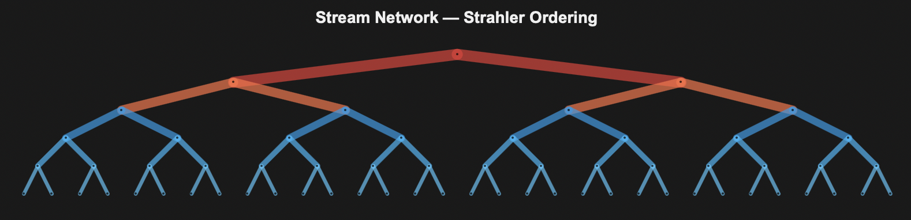
</p>

First-order headwater streams (blue) merge into higher-order channels (red). Candidate net sites are generated along these extracted streams.

## Candidate Site Generation

Candidate net sites are placed every 200 meters along the extracted stream network. The spacing uses the Haversine distance formula for great-circle distance between geographic coordinates:

$$d = 2R \arcsin\!\left(\sqrt{\sin^2\!\left(\frac{\Delta\phi}{2}\right) + \cos\phi_1 \cos\phi_2 \sin^2\!\left(\frac{\Delta\lambda}{2}\right)}\right)$$

where $R = 6{,}371$ km is the Earth's mean radius, $\phi$ is latitude, and $\lambda$ is longitude. Starting from the downstream end of each stream segment, the algorithm walks upstream, placing a candidate each time the accumulated distance exceeds 200 m. Each candidate has an associated upstream catchment, derived by backtracking the D8 grid.

```Mathematica
(* Candidate placement along a meandering stream *)
SeedRandom[12];

nPts = 200;
t = Subdivide[0, 4 Pi, nPts];
river = Table[{
  s + 1.2 Sin[1.3 s] + 0.5 Sin[2.7 s],
  s * 2.5 + 0.8 Cos[1.8 s]
}, {s, t}];
(* Note: if you get a bracket error, make sure all Sin[]/Cos[] use square brackets *)

spacing = 8;
candidates = river[[1 ;; ;; spacing]];

branchStart = river[[80]];
tributary = Table[
  branchStart + {-s + 0.6 Sin[2 s], s * 1.5 + 0.3 Cos[3 s]},
  {s, Subdivide[0, 3, 60]}
];
tribCandidates = tributary[[1 ;; ;; spacing]];

Graphics[{
  {RGBColor["#1565C0"], Thickness[0.005], Line[river]},
  {RGBColor["#42A5F5"], Thickness[0.003], Line[tributary]},
  {RGBColor["#58B09C"], Opacity[0.08], Disk[#, 2.5] & /@ candidates},
  {RGBColor["#58B09C"], PointSize[0.015], Point /@ candidates},
  {RGBColor["#81C784"], PointSize[0.012], Point /@ tribCandidates},
  {GrayLevel[0.3], Style[#, 9] & /@
    MapIndexed[Text[#2[[1]], #1 + {0.5, 0.5}] &, candidates]}
},
  PlotLabel -> Style["Candidate Net Sites \[LongDash] 200m Spacing", 14, Bold],
  Background -> White,
  PlotRange -> All,
  PlotRangePadding -> 2,
  ImageSize -> 800
]
```

<p align="center">
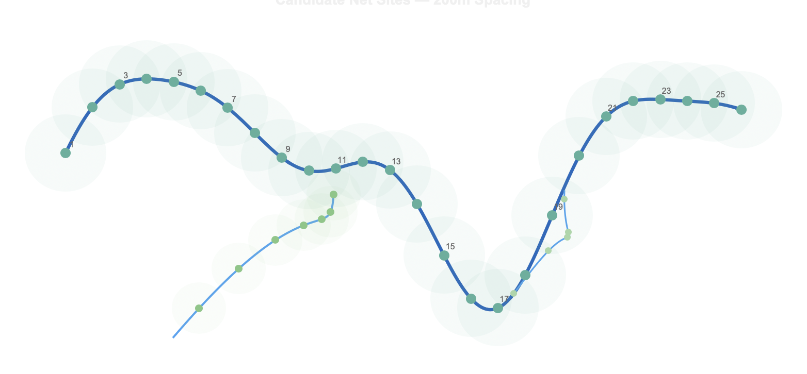
</p>

Each dot is a candidate net site. The faded circles represent the upstream catchment area that drains through each site — this determines how much trash generation potential each location has.

## Parameter Families & Scoring

Each candidate site is evaluated on 28 parameters organized into 6 families, which aggregate into 4 interpretable sub-scores. Parameters are normalized to [0, 1] before weighting.

### Generation Sub-Score

The Generation sub-score estimates how much trash enters the waterway upstream of the candidate. It combines seven parameters:

| Parameter | Weight | Source |
|---|---|---|
| `population_density` | 0.18 | Census ACS |
| `impervious_pct` | 0.20 | NLCD via 3DEP |
| `road_density_km_km2` | 0.10 | Census TIGER |
| `tri_facility_density` | 0.18 | EPA TRI |
| `npdes_points` | 0.12 | EPA ECHO |
| `cso_density` | 0.12 | EPA ECHO |
| `litter_complaint_density` | 0.10 | Municipal 311 |

### Cauchy Kernel for Proximity Scoring

Proximity-based parameters (TRI facilities, NPDES outfalls, CSO points) use a **Cauchy kernel** for inverse-distance weighting:

$$\text{score} = \sum_{i=1}^{N} \frac{1}{1 + \left(\frac{d_i}{h}\right)^2}$$

where $d_i$ is the distance from the candidate to source $i$ and $h = 500$ m is the half-decay distance. We chose Cauchy over Gaussian because it has heavier tails — a pollution source 2 km away still contributes meaningfully, reflecting the reality that urban runoff travels far.

```Mathematica
(* Cauchy vs Gaussian vs Exponential decay kernels *)
h = 500;

cauchy[d_] := 1 / (1 + (d/h)^2);
gaussian[d_] := Exp[-(d/h)^2];
exponential[d_] := Exp[-d/h];

Plot[{cauchy[d], gaussian[d], exponential[d]},
  {d, 0, 3000},
  PlotStyle -> {
    {RGBColor["#1565C0"], Thickness[0.004]},
    {RGBColor["#FF7043"], Thickness[0.004], Dashing[{0.02, 0.01}]},
    {RGBColor["#66BB6A"], Thickness[0.004], Dashing[{0.01, 0.01}]}
  },
  PlotLegends -> Placed[
    LineLegend[{"Cauchy (h=500m)", "Gaussian (h=500m)", "Exponential (h=500m)"},
      LegendFunction -> "Panel", LegendLayout -> "Column"],
    {0.75, 0.7}
  ],
  AxesLabel -> {"Distance (m)", "Weight"},
  PlotLabel -> Style["Proximity Decay Kernels", 14, Bold],
  PlotRange -> {0, 1.05},
  GridLines -> {{500, 1000, 1500, 2000, 2500}, {0.25, 0.5, 0.75, 1.0}},
  GridLinesStyle -> Directive[GrayLevel[0.85]],
  Filling -> {1 -> {Axis, Directive[RGBColor["#1565C0"], Opacity[0.08]]}},
  ImageSize -> 700
]
```

<p align="center">
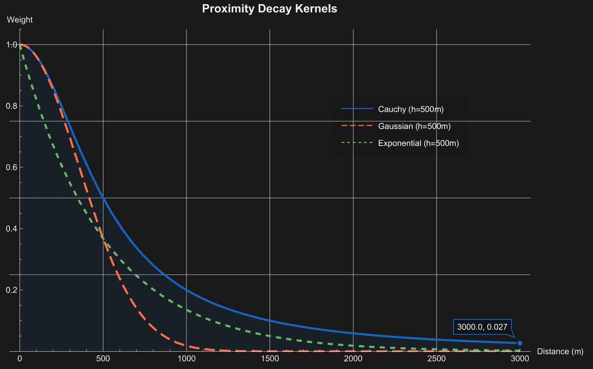
</p>

The Cauchy kernel (blue) retains meaningful weight out to 2+ km while the Gaussian (orange) drops to near-zero by 1 km. This matters in urban environments where runoff travels significant distances.

We can visualize the Generation sub-score as a surface over two of its dominant parameters — population density and impervious surface percentage:

```Mathematica
(* Generation sub-score surface *)
generationScore[popDens_, impervPct_] := Module[
  {popNorm, impNorm},
  popNorm = Min[popDens / 5000, 1];
  impNorm = impervPct / 100;
  0.18 popNorm + 0.20 impNorm +
    0.62 (0.4 popNorm + 0.6 impNorm)
];

Plot3D[100 generationScore[pop, imp],
  {pop, 0, 6000}, {imp, 0, 100},
  ColorFunction -> (Blend[{
    RGBColor["#1a1a2e"], RGBColor["#16213e"],
    RGBColor["#e94560"], RGBColor["#ffcc00"]}, #3] &),
  ColorFunctionScaling -> True,
  MeshFunctions -> {#3 &},
  MeshStyle -> Directive[GrayLevel[0.5], Opacity[0.3]],
  AxesLabel -> {"Pop. Density (people/km\[Superscript]2)", "Impervious (%)", "Score"},
  PlotLabel -> Style["Generation Sub-Score Surface", 14, Bold],
  BoxRatios -> {1, 1, 0.6},
  ViewPoint -> {2.8, -1.8, 1.5},
  Lighting -> "Neutral",
  PlotRange -> {0, 100},
  ImageSize -> 800
]
```

<p align="center">
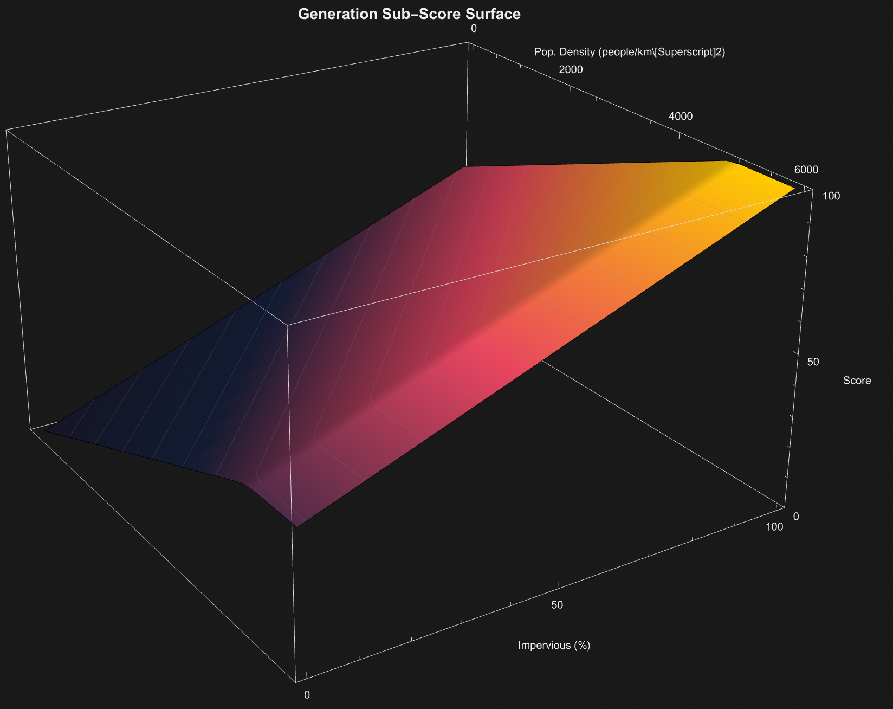
</p>

Peaks correspond to areas with high population density *and* high impervious surface cover — the urban cores where trash generation is highest.

### Flow Sub-Score

The Flow sub-score characterizes how water moves through the candidate site — whether current and discharge conditions are favorable for net deployment and trash capture.

| Parameter | Weight | Source |
|---|---|---|
| `usgs_mean_q_cfs` | 0.22 | USGS NWIS |
| `flow_velocity_ms` | 0.16 | Manning's Eq. |
| `strahler_order` | 0.14 | DEM-derived |
| `catchment_area_km2` | 0.18 | DEM-derived |
| `flood_q10_cfs` | 0.14 | USGS Stats |
| `seasonal_cv` | 0.10 | USGS NWIS |
| `runoff_coeff_C` | 0.06 | Land cover |

### Manning's Equation

Flow velocity is estimated using Manning's equation, the standard open-channel formula:

$$V = \frac{1}{n} \cdot R^{2/3} \cdot S^{1/2}$$

where $n$ is Manning's roughness coefficient (selected by channel type — 0.015 for concrete-lined urban channels up to 0.070 for sluggish weedy channels), $R$ is the hydraulic radius in meters, and $S$ is the channel slope computed from the DEM. The hydraulic radius assumes a rectangular channel cross-section:

$$R = \frac{W \times D}{W + 2D}$$

where $W$ is channel width and $D \approx 0.3W$ (bankfull depth approximation from fluvial geomorphology).

```Mathematica
(* Manning's velocity as function of slope and roughness *)
manningV[slope_, rough_] := (1/rough) * 0.5^(2/3) * Sqrt[slope];

Plot3D[manningV[slope, rough],
  {slope, 0.0001, 0.05}, {rough, 0.015, 0.070},
  ColorFunction -> (Blend[{
    RGBColor["#0D47A1"], RGBColor["#1565C0"],
    RGBColor["#42A5F5"], RGBColor["#FF7043"],
    RGBColor["#E53935"]}, #3] &),
  ColorFunctionScaling -> True,
  MeshFunctions -> {#3 &},
  MeshStyle -> Directive[GrayLevel[0.4], Opacity[0.3]],
  AxesLabel -> {"Slope", "Roughness", "Velocity (m/s)"},
  PlotLabel -> Style["Manning's Equation \[LongDash] V(S, n) at R = 0.5 m", 14, Bold],
  BoxRatios -> {1, 1, 0.7},
  ViewPoint -> {-2.5, -2, 1.5},
  Lighting -> "Neutral",
  PlotPoints -> 50,
  ImageSize -> 800
]
```

<p align="center">
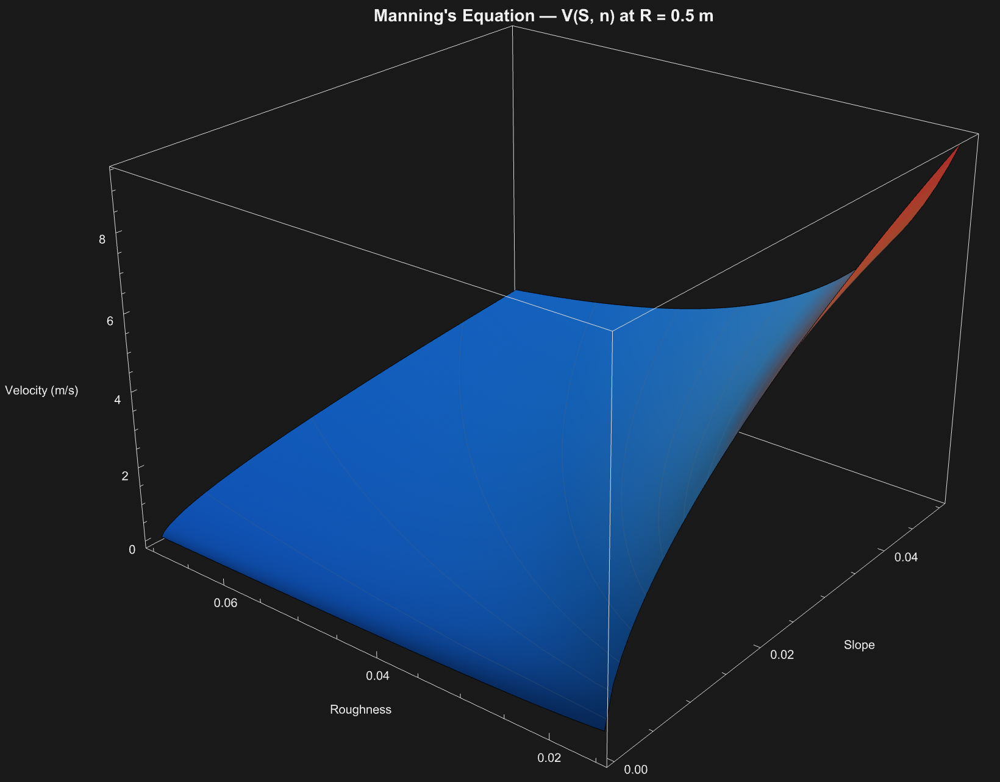
</p>

Steep, smooth channels (back-left) produce high velocities; flat, rough channels (front-right) produce low velocities. This surface governs how GRIME estimates flow conditions at every candidate site.

### Velocity Cross-Validation

A continuity cross-check is performed against USGS gauge data when available:

$$V_{\text{continuity}} = \frac{Q}{A} = \frac{Q}{W \times D}$$

The final velocity estimate is the **geometric mean** of both methods, hedging against errors in either the DEM slope (noisy at 10m resolution) or the rectangular channel assumption:

$$V_{\text{final}} = \sqrt{V_{\text{Manning}} \cdot V_{\text{continuity}}}$$

```Mathematica
(* Manning vs continuity velocity scatter *)
SeedRandom[99];
nPts = 40;

manningVals = RandomReal[{0.1, 3.5}, nPts];
continuityVals = manningVals * RandomReal[{0.6, 1.5}, nPts];

Show[
  ListPlot[
    {Transpose[{manningVals, continuityVals}]},
    PlotStyle -> {Directive[RGBColor["#1565C0"], PointSize[0.018], Opacity[0.6]]},
    PlotLegends -> {"Candidate sites"},
    AxesLabel -> {"Manning Velocity (m/s)", "Continuity Velocity (m/s)"},
    PlotLabel -> Style["Velocity Cross-Check", 14, Bold],
    PlotRange -> {{0, 4}, {0, 4}},
    GridLines -> Automatic,
    GridLinesStyle -> Directive[GrayLevel[0.9]],
    ImageSize -> 700
  ],
  Plot[x, {x, 0, 4},
    PlotStyle -> {GrayLevel[0.6], Dashing[{0.02, 0.01}]}],
  Graphics[{RGBColor["#E53935"], Thickness[0.003],
    Line[{{0, 0}, {4, 4}}]}]
]
```

<p align="center">
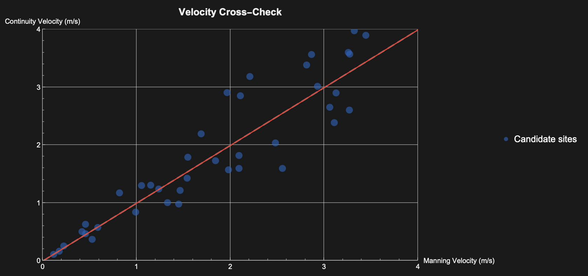
</p>

Points along the diagonal indicate agreement between methods. Outliers reveal where DEM-derived slope or channel geometry assumptions are unreliable — exactly the cases where the geometric mean provides a better estimate than trusting either method alone.

### Runoff Coefficient — The Rational Method

The runoff coefficient $C$ is derived from land cover composition within the upstream catchment using the Rational Method, inherited from WaterGate:

$$Q = C \cdot i \cdot A$$

where $Q$ is peak discharge, $i$ is rainfall intensity, and $A$ is catchment area. $C$ is a weighted average of land-cover-specific coefficients:

$$C = \frac{\sum_{j} c_j \cdot a_j}{\sum_{j} a_j}$$

```Mathematica
(* Runoff coefficient bar chart *)
data = {
  {"Impervious", 0.90},
  {"Commercial", 0.80},
  {"Dense Residential", 0.60},
  {"Suburban", 0.40},
  {"Open Grass", 0.20},
  {"Forest/Wetland", 0.10}
};

colors = {RGBColor["#E53935"], RGBColor["#FF7043"],
  RGBColor["#FFA726"], RGBColor["#FFCC02"],
  RGBColor["#66BB6A"], RGBColor["#2E7D32"]};

BarChart[
  data[[All, 2]],
  ChartLabels -> Placed[data[[All, 1]], Below],
  ChartStyle -> colors,
  BarSpacing -> 0.4,
  PlotLabel -> Style["Runoff Coefficient by Land Cover Type", 14, Bold],
  AxesLabel -> {None, "Runoff Coefficient C"},
  PlotRange -> {0, 1.05},
  GridLines -> {None, {0.2, 0.4, 0.6, 0.8, 1.0}},
  GridLinesStyle -> Directive[GrayLevel[0.85]],
  LabelStyle -> Directive[10],
  ImageSize -> 700
]
```

<p align="center">
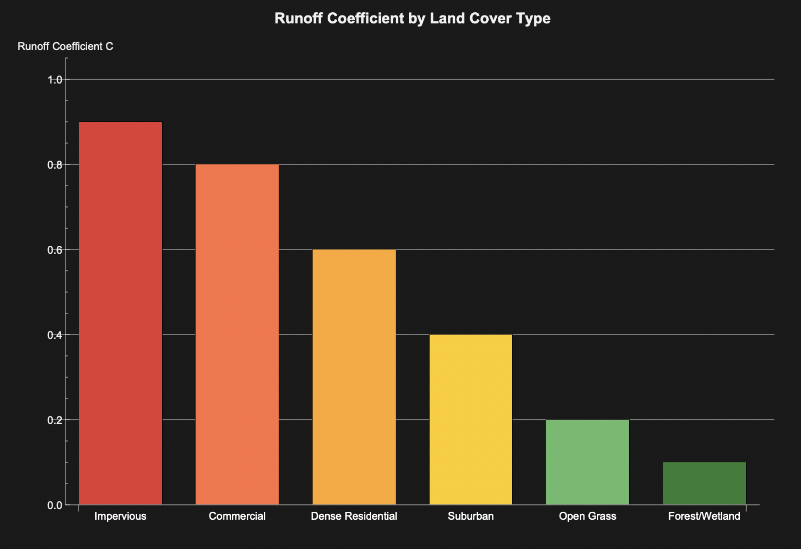
</p>

Urban impervious surfaces shed 90% of rainfall as runoff; forested areas absorb 90%. This directly affects how much trash is transported to waterways during storm events.

### Impact Sub-Score

The Impact sub-score quantifies the downstream consequences of trash passing through the candidate site uncaptured — what's at stake if no net is placed here.

| Parameter | Weight | Source |
|---|---|---|
| `water_intake_score` | 0.22 | EPA SDWIS |
| `protected_area_score` | 0.16 | USGS PAD-US |
| `ej_index` | 0.18 | EPA EJSCREEN |
| `estuary_dist_km` | 0.14 | NHD / OSM |
| `beach_dist_km` | 0.12 | NHD / OSM |
| `tourism_amenity_density` | 0.10 | OSM |
| `superfund_score` | 0.08 | EPA |

Unlike other proximity parameters that use the Cauchy kernel, **drinking water intakes use exponential decay** for sharper distance sensitivity:

$$\text{score} = \sum_{i} \exp\!\left(-\frac{d_i}{10}\right)$$

This gives an intake within 1 km a weight of $\approx 0.90$ and one within 5 km a weight of $\approx 0.61$. The sharper decay reflects urgency: trash near a drinking water intake is a public health risk, not just an aesthetic one.

```Mathematica
(* Exponential decay vs Cauchy decay *)
expDecay[d_] := Exp[-d/10];
cauchyDecay[d_] := 1/(1 + (d/0.5)^2);

Plot[{expDecay[d], cauchyDecay[d]},
  {d, 0, 15},
  PlotStyle -> {
    {RGBColor["#E53935"], Thickness[0.004]},
    {RGBColor["#1565C0"], Thickness[0.004], Dashing[{0.02, 0.01}]}
  },
  PlotLegends -> Placed[
    LineLegend[{
      "Exponential (drinking water intakes)",
      "Cauchy (pollution sources)"},
      LegendFunction -> "Panel"],
    {0.65, 0.7}
  ],
  AxesLabel -> {"Distance (km)", "Weight"},
  PlotLabel -> Style["Impact Decay Functions", 14, Bold],
  Filling -> {
    1 -> {Axis, Directive[RGBColor["#E53935"], Opacity[0.06]]},
    2 -> {Axis, Directive[RGBColor["#1565C0"], Opacity[0.06]]}
  },
  PlotRange -> {0, 1.05},
  GridLines -> {{1, 5, 10}, {0.25, 0.5, 0.75}},
  GridLinesStyle -> Directive[GrayLevel[0.85]],
  ImageSize -> 700
]
```

<p align="center">
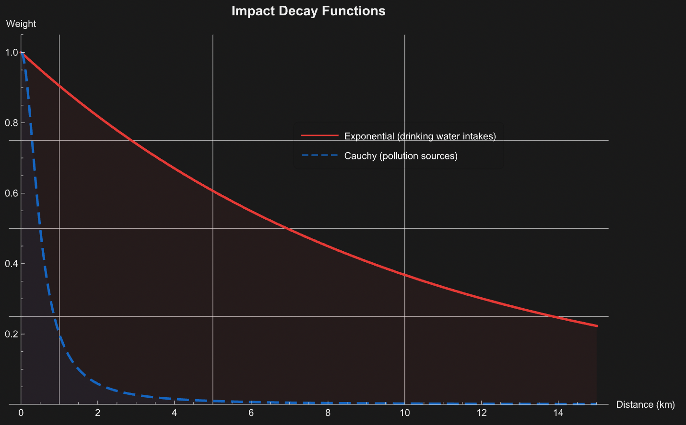
</p>

### Environmental Justice Weighting

The EJ index is a composite from EPA's EJSCREEN tool. It combines demographic indicators (% minority, % low-income, % linguistically isolated) with environmental burden indicators (proximity to hazardous waste, traffic exposure, air quality). GRIME includes this as a **first-class parameter** because communities with the least political power to demand cleanup are often the most affected by waterway pollution.

```Mathematica
(* EJ Index surface across synthetic metro region *)
SeedRandom[33];
gridSize = 50;

ej = Table[
  0.2 +
  0.6 Exp[-((x - 15)^2 + (y - 35)^2)/40] +
  0.5 Exp[-((x - 38)^2 + (y - 12)^2)/30] +
  0.3 Exp[-((x - 10)^2 + (y - 10)^2)/25] +
  RandomReal[{-0.05, 0.05}],
  {y, 1, gridSize}, {x, 1, gridSize}
];

ListPlot3D[ej,
  ColorFunction -> (Blend[{
    RGBColor["#1B5E20"], RGBColor["#FDD835"],
    RGBColor["#FF6F00"], RGBColor["#B71C1C"]}, #] &),
  ColorFunctionScaling -> True,
  MeshFunctions -> {#3 &},
  MeshStyle -> Directive[GrayLevel[0.5], Opacity[0.2]],
  BoxRatios -> {1, 1, 0.5},
  PlotLabel -> Style["Environmental Justice Index \[LongDash] Metro Region", 14, Bold],
  AxesLabel -> {"Easting", "Northing", "EJ Index"},
  ViewPoint -> {2.2, -2.5, 1.8},
  Lighting -> "Neutral",
  ImageSize -> 800
]
```

<p align="center">
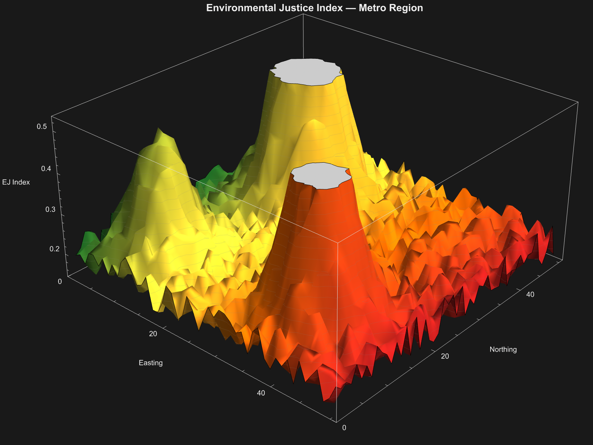
</p>

Peaks identify overburdened communities where trash interception has the highest equity value. This surface directly weights the Impact sub-score.

### Feasibility Sub-Score

The Feasibility sub-score determines whether a net can physically be installed, maintained, and accessed at the candidate site.

| Parameter | Weight | Source |
|---|---|---|
| `road_access_score` | 0.25 | OSM |
| `channel_width_score` | 0.20 | OSM / heuristic |
| `velocity_feasibility` | 0.20 | Manning's Eq. |
| `land_ownership` | 0.15 | USGS PAD-US |
| `bank_slope_score` | 0.10 | DEM |
| `bridge_proximity_bonus` | 0.10 | OSM |

Fewer than 5% of OpenStreetMap waterways have explicit width tags, so GRIME uses a heuristic estimator based on waterway type (`ditch` → 1.5m, `stream` → 4m, `canal` → 8m, `river` → 15–40m depending on Strahler order).

### Velocity Feasibility Function

Flow velocity affects feasibility non-linearly. Very low velocity means little trash transport; very high velocity means nets will be destroyed. The feasibility function is a piecewise curve:

$$f(v) = \begin{cases} 0.3 & v < 0.1 \;\text{m/s} \\ \frac{v - 0.1}{0.4} & 0.1 \leq v < 0.5 \\ 1.0 & 0.5 \leq v \leq 1.5 \\ \frac{3.0 - v}{1.5} & 1.5 < v \leq 3.0 \\ 0 & v > 3.0 \end{cases}$$

```Mathematica
(* Piecewise velocity feasibility *)
feasibility[v_] := Piecewise[{
  {0.3, v < 0.1},
  {(v - 0.1)/0.4, 0.1 <= v < 0.5},
  {1.0, 0.5 <= v <= 1.5},
  {(3.0 - v)/1.5, 1.5 < v <= 3.0},
  {0, v > 3.0}
}];

Plot[feasibility[v], {v, 0, 4},
  PlotStyle -> {RGBColor["#1565C0"], Thickness[0.004]},
  Filling -> Axis,
  FillingStyle -> Directive[RGBColor["#1565C0"], Opacity[0.12]],
  AxesLabel -> {"Flow Velocity (m/s)", "Feasibility Score"},
  PlotLabel -> Style["Velocity Feasibility Function", 14, Bold],
  PlotRange -> {-0.05, 1.1},
  Epilog -> {
    {RGBColor["#66BB6A"], Opacity[0.15],
      Rectangle[{0.5, 0}, {1.5, 1.0}]},
    {RGBColor["#E53935"], Dashing[{0.02, 0.01}], Thickness[0.003],
      Line[{{3.0, 0}, {3.0, 1.1}}]},
    Text[Style["Optimal\nRange", 10, RGBColor["#2E7D32"]], {1.0, 0.85}],
    Text[Style["Hard\nGate", 10, RGBColor["#E53935"]], {3.3, 0.5}],
    Text[Style["Too slow\n(little transport)", 9, GrayLevel[0.5]], {0.05, 0.45}, {-1, 0}],
    Text[Style["Too fast\n(net failure)", 9, GrayLevel[0.5]], {3.5, 0.15}, {-1, 0}]
  },
  GridLines -> {{0.5, 1.5, 3.0}, {0.5, 1.0}},
  GridLinesStyle -> Directive[GrayLevel[0.85]],
  ImageSize -> 700
]
```

<p align="center">
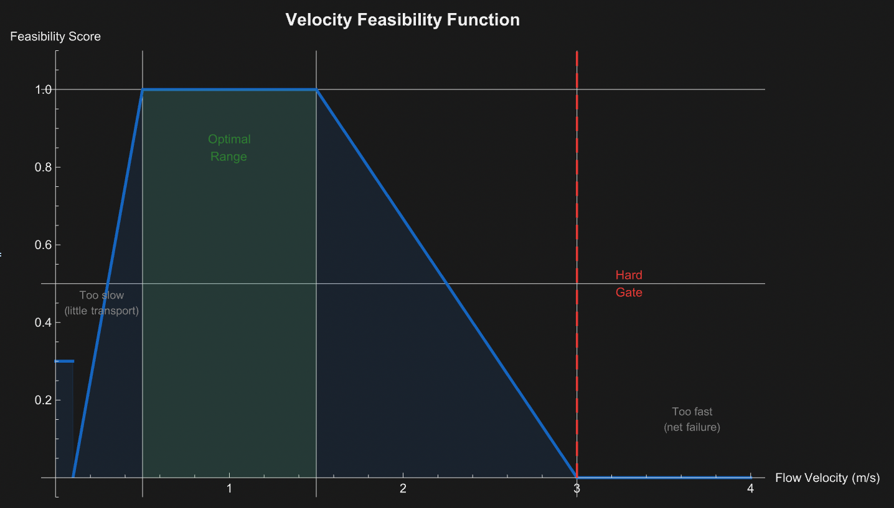
</p>

The sweet spot is 0.5–1.5 m/s — enough current to transport trash into nets without exceeding the structural limits of standard boom-and-net systems. Above 3.0 m/s, the hard gate eliminates the site entirely.

We can also view the full feasibility surface as a function of both channel width and velocity:

```Mathematica
(* Feasibility surface: width x velocity *)
widthScore[w_] := Piecewise[{
  {0.2, w < 1},
  {1.0, 1 <= w <= 15},
  {Max[0, (50 - w)/35], 15 < w <= 50},
  {0, w > 50}
}];

velFeas[v_] := Piecewise[{
  {0.3, v < 0.1},
  {(v - 0.1)/0.4, 0.1 <= v < 0.5},
  {1.0, 0.5 <= v <= 1.5},
  {(3.0 - v)/1.5, 1.5 < v <= 3.0},
  {0, v > 3.0}
}];

feasComposite[w_, v_] := 0.5 widthScore[w] + 0.5 velFeas[v];

Plot3D[feasComposite[w, v],
  {w, 0, 60}, {v, 0, 4},
  ColorFunction -> (Blend[{
    RGBColor["#B71C1C"], RGBColor["#FF7043"],
    RGBColor["#FFCC02"], RGBColor["#66BB6A"],
    RGBColor["#1B5E20"]}, #3] &),
  ColorFunctionScaling -> True,
  MeshFunctions -> {#3 &},
  MeshStyle -> Directive[GrayLevel[0.5], Opacity[0.3]],
  AxesLabel -> {"Channel Width (m)", "Velocity (m/s)", "Feasibility"},
  PlotLabel -> Style["Feasibility Score \[LongDash] Width \[Times] Velocity", 14, Bold],
  BoxRatios -> {1, 1, 0.6},
  ViewPoint -> {2.5, -2, 1.5},
  Lighting -> "Neutral",
  PlotRange -> {0, 1},
  PlotPoints -> 60,
  ImageSize -> 800,
  Exclusions -> None
]
```

<p align="center">
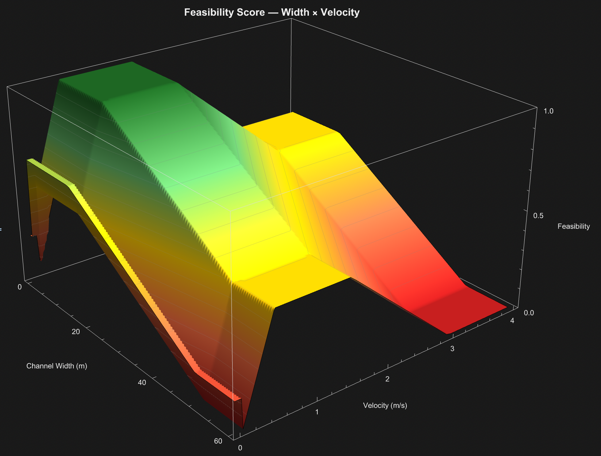
</p>

The ridge along the diagonal represents the ideal combination: narrow, moderate-velocity channels where nets can be spanned and anchored.

## Two-Level Scoring Architecture

GRIME uses a two-level weighted architecture deliberately chosen over a flat 28-parameter weighted sum. At **Level 1**, parameters within each family combine into sub-scores:

$$S_k = \sum_{j \in \mathcal{F}_k} w_{k,j} \cdot p_{k,j}$$

At **Level 2**, the four sub-scores combine into the composite:

$$C = 100 \times \sum_{k} W_k \cdot S_k$$

| Sub-Score | Weight $W_k$ |
|---|---|
| Generation | 0.30 |
| Flow | 0.25 |
| Impact | 0.30 |
| Feasibility | 0.15 |

This structure means a city planner can immediately see "high generation, low feasibility" without parsing 28 individual numbers.

```Mathematica
(* Composite score surface: Generation x Impact *)
composite[gen_, imp_] :=
  100 (0.30 gen + 0.25 * 0.5 + 0.30 imp + 0.15 * 0.7);

Plot3D[composite[gen, imp],
  {gen, 0, 1}, {imp, 0, 1},
  ColorFunction -> (Blend[{
    RGBColor["#1a1a2e"], RGBColor["#0f3460"],
    RGBColor["#e94560"], RGBColor["#ffcc00"]}, #3] &),
  ColorFunctionScaling -> True,
  MeshFunctions -> {#3 &},
  MeshStyle -> Directive[GrayLevel[0.5], Opacity[0.3]],
  AxesLabel -> {"Generation", "Impact", "Composite Score"},
  PlotLabel -> Style[
    "Composite Score \[LongDash] Generation \[Times] Impact\n(Flow=0.5, Feasibility=0.7 fixed)", 13, Bold],
  BoxRatios -> {1, 1, 0.6},
  ViewPoint -> {2.5, -2, 1.5},
  Lighting -> "Neutral",
  PlotRange -> {0, 100},
  PlotPoints -> 40,
  ImageSize -> 800
]
```

<p align="center">
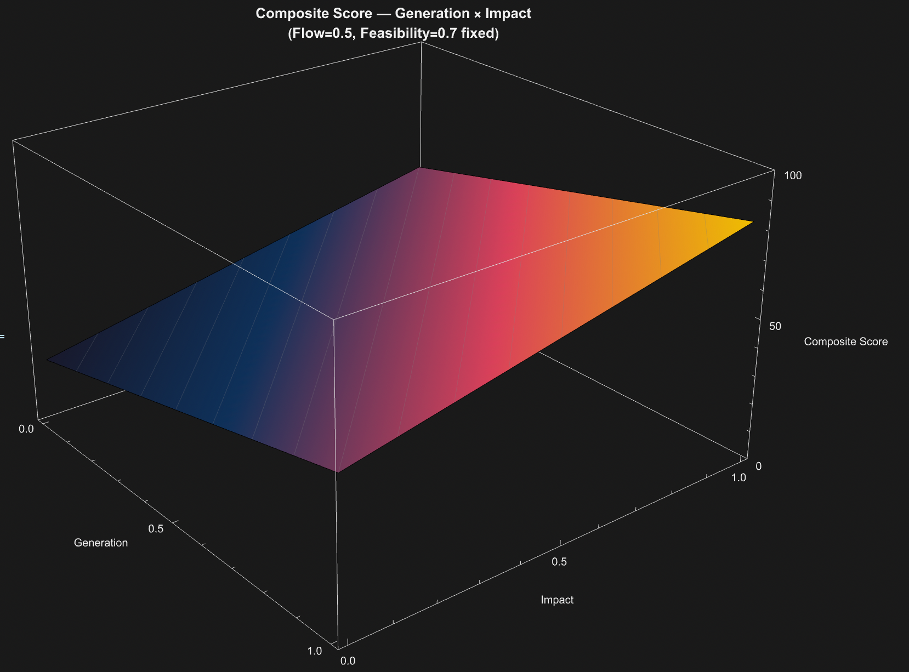
</p>

The diagonal ridge shows that high scores require both trash presence *and* downstream consequence. A site with lots of generation but no downstream impact — or high impact but no trash source — scores only moderately.

## Hard Gates & Constraint Satisfaction

Before scoring begins, candidates are filtered through three hard gates. A site that fails **any** gate is eliminated regardless of its parameter scores:

| Gate | Threshold | Rationale |
|---|---|---|
| Channel width | > 50 m | Cannot span with standard boom systems |
| Flow velocity | > 3.0 m/s | Net structural failure |
| Land ownership | Private (confirmed) | No legal deployment authority |

```Mathematica
(* Hard gate constraint filtering *)
SeedRandom[55];
nCandidates = 200;

widths = RandomReal[{1, 80}, nCandidates];
velocities = RandomReal[{0.05, 5}, nCandidates];
ownership = RandomChoice[{"public", "public", "public", "private"}, nCandidates];

passGate = MapThread[
  (#1 <= 50 && #2 <= 3.0 && #3 == "public") &,
  {widths, velocities, ownership}
];

Graphics[{
  {GrayLevel[0.8], PointSize[0.012],
    Point /@ Pick[Transpose[{widths, velocities}], passGate, False]},
  {PointSize[0.016],
    MapThread[
      If[#2,
        {Blend[{RGBColor["#1565C0"], RGBColor["#66BB6A"], RGBColor["#FFCC02"]},
          RandomReal[]], Point[#1]},
        Nothing
      ] &,
      {Transpose[{widths, velocities}], passGate}
    ]
  },
  {RGBColor["#E53935"], Thickness[0.003], Dashing[{0.02, 0.01}],
    Line[{{50, 0}, {50, 5.5}}]},
  {RGBColor["#E53935"], Thickness[0.003], Dashing[{0.02, 0.01}],
    Line[{{0, 3.0}, {85, 3.0}}]},
  Text[Style["Width Gate: 50m", 11, RGBColor["#E53935"]], {52, 4.8}, {-1, 0}],
  Text[Style["Velocity Gate: 3.0 m/s", 11, RGBColor["#E53935"]], {60, 3.2}, {-1, -1}],
  Text[Style["Feasible", 12, Bold, RGBColor["#1B5E20"]], {25, 1.5}],
  Text[Style["Eliminated", 11, GrayLevel[0.6]], {65, 1.5}]
},
  Axes -> True,
  AxesLabel -> {"Channel Width (m)", "Flow Velocity (m/s)"},
  PlotLabel -> Style["Hard Gate Constraint Filtering", 14, Bold],
  PlotRange -> {{0, 85}, {0, 5.5}},
  ImageSize -> 750,
  Background -> White
]
```

<p align="center">
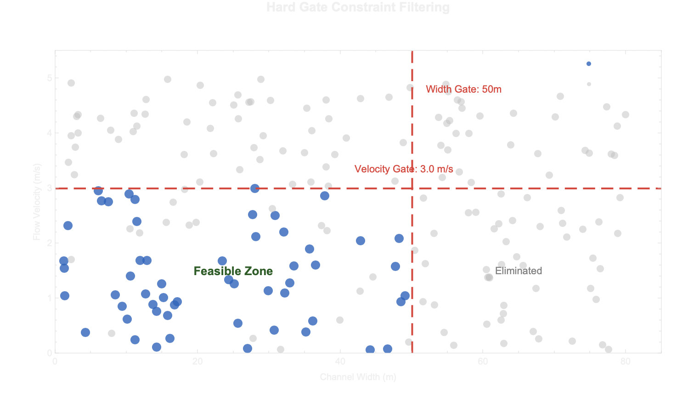
</p>

Gray points are eliminated by hard gates; colored points survive to full scoring. The red dashed lines mark the gate boundaries. A site with perfect generation and impact scores in a 100-meter-wide private channel is simply not a valid candidate.

## Monte Carlo Sensitivity Analysis

Because GRIME's weights are set by informed heuristic rather than fitted to ground truth (there is no public dataset of correct trash net placements), the model includes a built-in sensitivity analysis. The question it answers: *if we had chosen slightly different weights, would the top-ranked sites change?*

### Dirichlet Perturbation

The baseline sub-score weights $\boldsymbol{W} = [0.30, 0.25, 0.30, 0.15]$ are perturbed by sampling from a Dirichlet distribution:

$$\boldsymbol{\omega}' \sim \text{Dir}(\boldsymbol{\alpha}), \quad \boldsymbol{\alpha} = \kappa \cdot \boldsymbol{W}$$

where $\kappa = 10$ is the concentration parameter. Higher $\kappa$ concentrates samples closer to the baseline; lower $\kappa$ allows more extreme perturbations. The Dirichlet distribution is the natural choice because it produces weight vectors that are non-negative and sum to 1.

```Mathematica
(* Dirichlet samples projected onto ternary diagram *)
SeedRandom[42];

baseline = {0.30, 0.30, 0.15};
kappa = 10;
alpha = kappa * baseline;

samples = RandomVariate[DirichletDistribution[alpha], 500];
samples3 = (# / Total[#]) & /@ samples;

ternary[{a_, b_, c_}] := Module[{s = a + b + c},
  {(2 b + c) / (2 s), c Sqrt[3] / (2 s)}
];

pts = ternary /@ samples3;
baselinePt = ternary[baseline / Total[baseline]];

Graphics[{
  {GrayLevel[0.3], Thickness[0.002],
    Line[{ternary[{1,0,0}], ternary[{0,1,0}], ternary[{0,0,1}], ternary[{1,0,0}]}]},
  {RGBColor["#1565C0"], Opacity[0.3], PointSize[0.006],
    Point /@ pts},
  {RGBColor["#E53935"], PointSize[0.025], Point[baselinePt]},
  {RGBColor["#E53935"],
    Text[Style["  Baseline", 11, Bold], baselinePt, {-1, 0}]},
  Text[Style["Generation", 12, Bold], ternary[{1, 0, 0}] + {0, -0.04}],
  Text[Style["Impact", 12, Bold], ternary[{0, 1, 0}] + {0, -0.04}],
  Text[Style["Feasibility", 12, Bold], ternary[{0, 0, 1}] + {0, 0.04}]
},
  PlotLabel -> Style["Dirichlet Weight Perturbations (\[Kappa] = 10)", 14, Bold],
  PlotRange -> {{-0.15, 1.15}, {-0.12, 1.0}},
  ImageSize -> 700,
  Background -> White
]
```

<p align="center">
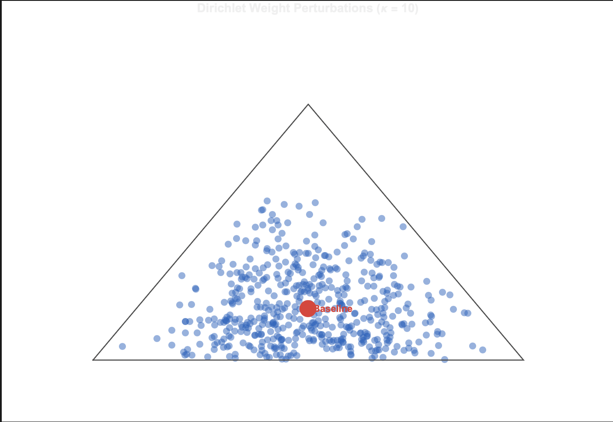
</p>

Each blue dot is a sampled weight vector. The red star is the baseline. The cloud's spread shows the range of weight assumptions being tested — concentrated enough to be realistic, diverse enough to be informative.

### Robustness Scoring

For each of 50 sampled weight vectors, the composite score is recomputed for all candidates and the top 5 are recorded. A site's **robustness** is the fraction of perturbations where it appears in the top 5:

$$\text{Robustness}(i) = \frac{1}{M} \sum_{m=1}^{M} \mathbb{1}\!\left[i \in \text{Top}_5^{(m)}\right]$$

```Mathematica
(* Robustness score distribution *)
SeedRandom[77];

robustness = Join[
  RandomReal[BetaDistribution[1.5, 8], 180],
  RandomReal[BetaDistribution[3, 2], 15],
  RandomReal[BetaDistribution[12, 1.5], 5]
] * 100;

Histogram[robustness,
  {10},
  ColorFunction -> Function[{height, x},
    Blend[{RGBColor["#1565C0"], RGBColor["#66BB6A"],
      RGBColor["#FFCC02"], RGBColor["#E53935"]}, x]],
  AxesLabel -> {"Robustness (%)", "Number of Sites"},
  PlotLabel -> Style["Robustness Score Distribution\n(50 Dirichlet Perturbations)", 14, Bold],
  ChartBaseStyle -> EdgeForm[GrayLevel[0.4]],
  GridLines -> {None, Automatic},
  GridLinesStyle -> Directive[GrayLevel[0.9]],
  Epilog -> {
    {RGBColor["#E53935"], Opacity[0.08], Rectangle[{0, 0}, {30, 80}]},
    {RGBColor["#FFCC02"], Opacity[0.08], Rectangle[{50, 0}, {90, 80}]},
    {RGBColor["#1B5E20"], Opacity[0.08], Rectangle[{90, 0}, {100, 80}]},
    Text[Style["Weight-\nsensitive", 9, GrayLevel[0.5]], {15, 70}],
    Text[Style["Moderate", 9, GrayLevel[0.5]], {70, 70}],
    Text[Style["Robust", 9, Bold, RGBColor["#1B5E20"]], {95, 70}]
  },
  ImageSize -> 700
]
```

<p align="center">
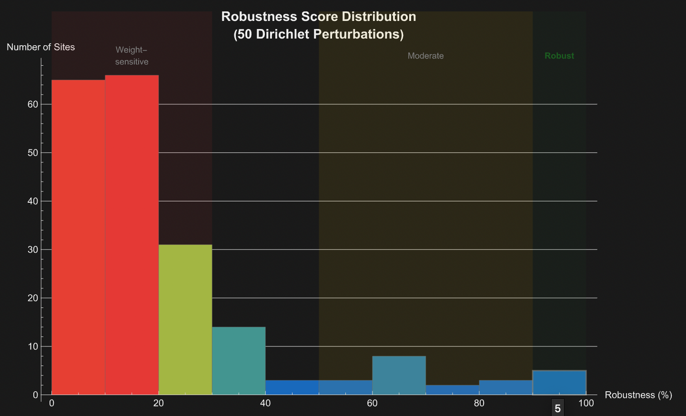
</p>

Most sites have low robustness (they rank highly only under specific weight assumptions). The small cluster near 90–100% represents robust recommendations — sites that are genuinely good regardless of how you weight generation vs. impact vs. feasibility.

We can also visualize rank stability across all perturbations as a heatmap:

```Mathematica
(* Rank stability heatmap *)
SeedRandom[88];

nSites = 20;
nPerturbations = 50;

ranks = Table[
  Module[{base = i, noise = If[i <= 5, 2, If[i <= 10, 5, 8]]},
    Clip[Round[base + RandomReal[{-noise, noise}]], {1, nSites}]
  ],
  {i, nSites}, {j, nPerturbations}
];

MatrixPlot[ranks,
  ColorFunction -> (Blend[{
    RGBColor["#1B5E20"], RGBColor["#66BB6A"],
    RGBColor["#FFCC02"], RGBColor["#FF7043"],
    RGBColor["#E53935"]}, #] &),
  ColorFunctionScaling -> True,
  FrameLabel -> {"Site (sorted by baseline rank)", "Perturbation #"},
  PlotLabel -> Style["Rank Stability Across Weight Perturbations", 14, Bold],
  PlotLegends -> BarLegend[{
    Blend[{RGBColor["#1B5E20"], RGBColor["#66BB6A"],
      RGBColor["#FFCC02"], RGBColor["#FF7043"],
      RGBColor["#E53935"]}, #] &, {1, nSites}},
    LegendLabel -> "Rank"],
  ImageSize -> 800
]
```

<p align="center">
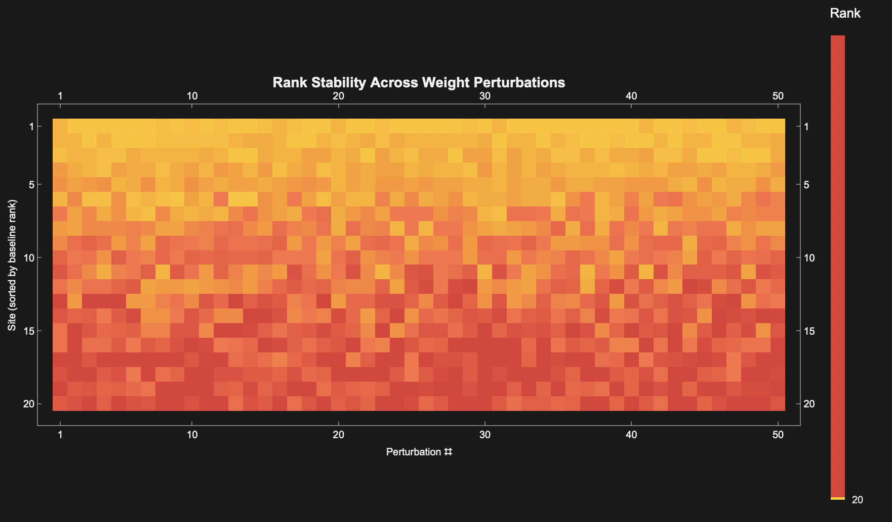
</p>

Top rows (highest-ranked sites) maintain consistently green colors — stable ranks across all 50 perturbations. Bottom rows swing between green and red, indicating sensitivity to weight choices.

## Application: Durham, NC

Putting it all together on a real city. The 3D terrain surface of the Durham region, rendered from USGS 3DEP 10m data, defines the flow paths that determine where water and trash accumulate:

```Mathematica
(* 3D terrain surface — Durham, NC *)
demDurham = QuantityMagnitude[GeoElevationData[
  Entity["City", {"Durham", "NorthCarolina", "UnitedStates"}],
  GeoRange -> Quantity[15, "Kilometers"],
  GeoProjection -> Automatic
]];

ListPlot3D[demDurham,
  PlotRange -> All,
  ColorFunction -> "AlpineColors",
  MeshFunctions -> {#3 &},
  MeshStyle -> Opacity[0.2],
  Lighting -> "Neutral",
  BoxRatios -> {1, 1, 0.3},
  PlotLabel -> Style["DEM Surface \[LongDash] Durham, NC (10m Resolution)", 14, Bold],
  AxesLabel -> {"Easting (m)", "Northing (m)", "Elevation (m)"},
  ImageSize -> 800,
  ViewPoint -> {2.5, -2, 1.5}
]
```

<p align="center">

</p>

From this DEM, the pipeline extracts streams, generates candidates every 200m, queries six federal APIs for parameter data, scores each site, and runs the Dirichlet sensitivity analysis. The output is a ranked list of deployment sites with sub-score breakdowns that Durham Stormwater Services can use to prioritize net installations.

## Application: Global Dashboard

The interactive dashboard lets anyone click on any of 108,772 cities across 240 countries. When a city is selected:

1. An **Overpass API** query fetches real waterway geometry from OpenStreetMap
2. Candidate sites are placed every 200m along each waterway using Haversine spacing
3. **Hard gates** eliminate infeasible sites (width > 50m, velocity > 3.0 m/s)
4. Each surviving candidate is scored using the 28-parameter model with OSM-derived proxies
5. A **population-scaled risk percentile** threshold filters out low-scoring candidates
6. Remaining candidates are color-coded by composite score and rendered on a Mapbox map

```Mathematica
(* Dashboard pipeline as a flowchart *)
nodes = {"City Selection", "Overpass API", "Waterway Geometry",
  "Candidate Generation", "Hard Gate Filter",
  "Scoring (28 params)", "Risk Filter",
  "Map Rendering"};

edges = Thread[nodes[[;; -2]] -> nodes[[2 ;;]]];

colors = {RGBColor["#58B09C"], RGBColor["#42A5F5"], RGBColor["#42A5F5"],
  RGBColor["#66BB6A"], RGBColor["#E53935"], RGBColor["#FF7043"],
  RGBColor["#FFCC02"], RGBColor["#58B09C"]};

Graph[edges,
  VertexLabels -> Placed["Name", Center],
  VertexLabelStyle -> Directive[9, Bold, White],
  VertexStyle -> Thread[nodes -> (Directive[#, EdgeForm[None]] & /@ colors)],
  VertexSize -> 0.75,
  VertexShapeFunction -> "RoundedRectangle",
  EdgeStyle -> Directive[GrayLevel[0.5], Thickness[0.004], Arrowheads[0.04]],
  GraphLayout -> {"LayeredDigraphEmbedding", "Orientation" -> Left},
  PlotLabel -> Style["Dashboard Client-Side Scoring Pipeline", 14, Bold],
  ImageSize -> 900
]
```

<p align="center">
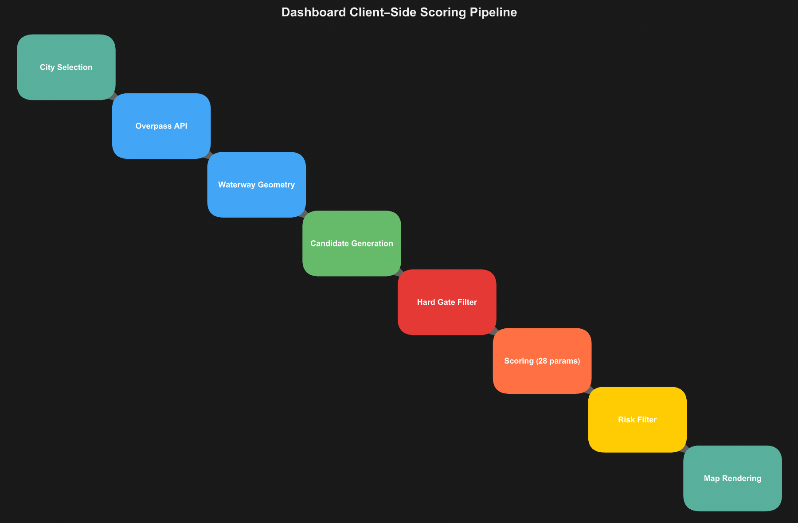
</p>

Dashboard scores are approximate — the Python pipeline is the authoritative scoring implementation. But the dashboard puts GRIME's methodology in anyone's hands, anywhere in the world, in under 5 seconds.

---

*All visualizations generated in the Wolfram Language. Export at 2x resolution for retina displays:*

```Mathematica
Export["filename.png", %, ImageResolution -> 144]
```

*Place all exported PNGs in `dashboard/docs/images/` using the filenames referenced in this document.*
